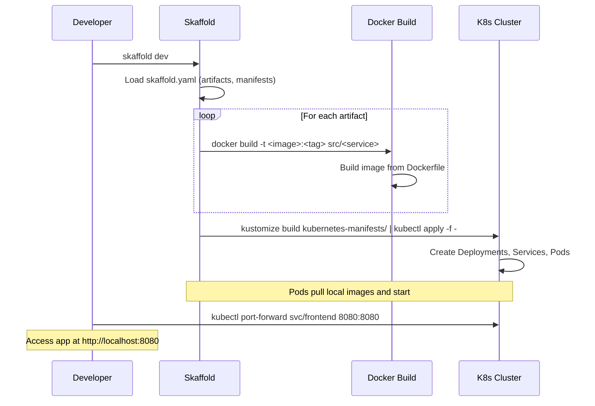
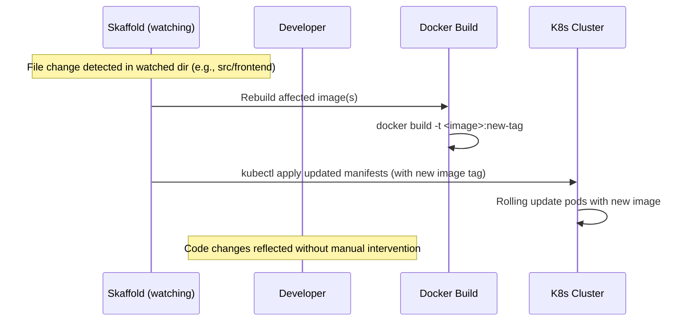

# High-Level Design: Local Development Workflow

## Overview

The Local Development Workflow enables developers to deploy and run the entire Online Boutique microservices application on a local Kubernetes cluster, such as Minikube, Kind, or Docker Desktop's Kubernetes. It uses Skaffold to automate the building of Docker images from source code in the `src/` directories, deployment of Kubernetes manifests from `kubernetes-manifests/`, and continuous watching for code changes to enable hot reloading. This facilitates rapid development iteration without the need for remote cloud resources or manual build/deploy steps.

Key benefits include:
- Automated image builds using local Docker.
- Declarative Kubernetes deployments via Kustomize.
- Hot reload on file changes in service source code.
- Support for debugging and optional configurations via Skaffold profiles.

Prerequisites:
- Local Kubernetes cluster running.
- Docker installed and configured.
- Skaffold installed (CLI tool).

The workflow is initiated by running `skaffold dev` from the project root. Access the application via `kubectl port-forward deployment/frontend 8080:8080` and browse to `http://localhost:8080`.

## Components

- **Skaffold**: The core orchestrator defined in `skaffold.yaml`. It specifies build artifacts (one per microservice, with build contexts in `src/<service>`), manifest paths (`kubernetes-manifests/` processed via Kustomize), and deployment via `kubectl`. Supports multiple configs (main 'app' and 'loadgenerator') and profiles for customization.
  
- **Dockerfiles**: Service-specific Dockerfiles in `src/<service>/Dockerfile` (e.g., multi-stage Go builds for Go services, Node.js for JS services). Skaffold builds these locally using Docker CLI and Buildkit for efficiency.

- **Kubernetes Manifests**: YAML files in `kubernetes-manifests/` defining Deployments, Services, Pods, etc., for all 11 microservices, Redis (cart store), and loadgenerator. Image references (e.g., `image: frontend`) are updated by Skaffold with generated tags.

- **Kustomize**: Used by Skaffold to build manifests, allowing bases and patches (e.g., via profiles adding components like network policies).

- **Local Kubernetes Cluster**: Runs the deployed pods and services. Internal gRPC communication between services occurs over cluster networking.

- **Profiles and Patches**: Skaffold profiles enable modes like `debug` (swaps cartservice Dockerfile for debugging) or `network-policies` (adds Kustomize overlays).

- **Tag Policy**: `gitCommit` policy tags images with Git commit SHA for versioning.

## Sequence Diagram: Initial Deployment

This diagram illustrates the startup sequence: Skaffold builds all service images in parallel loops, deploys the cluster resources, and enables local access.

## Sequence Diagram: Hot Reload Cycle

During development, Skaffold monitors file changes in build contexts. Upon detection, it rebuilds only affected images and triggers a deployment update, typically a rolling pod update in Kubernetes.

## Additional High-Level Design Aspects

### Build Process Details
- **.NET Services (cartservice)**: Uses `dotnet publish` in Dockerfile with multi-stage build; depends on grpc.tools for protobuf compilation. To ensure ARM64 compatibility, use Grpc.AspNetCore and Grpc.HealthCheck versions <=2.67.0 (e.g., PR #3068 downgraded from 2.71.0 to fix protoc exit code 139 on linux_arm64).
- **Platforms**: Supports `linux/amd64` and `linux/arm64` for multi-arch builds.
- **Local Build**: Uses `local` builder with `useDockerCLI: true` and `useBuildkit: true` for fast, cached builds without pushing to a registry.
- **Dependencies**: Some services require proto generation (via `genproto.sh` scripts); generated files (e.g., `demo.pb.go`) are included in source trees and built into images. Changes to `.proto` files may require manual regeneration before rebuild.
- **Load Generator**: Handled via a separate Skaffold config requiring the main 'app' config, ensuring it's deployed alongside services.

### Deployment and Runtime
- **Manifest Updates**: Skaffold replaces image tags in manifests during deploy.
- **Health Checks and Probes**: Defined in manifests (e.g., readiness probes in frontend.yaml) ensure pods are healthy before traffic routing.
- **Service Discovery**: Kubernetes Services enable gRPC communication between pods using service names (e.g., frontend calls productcatalogservice).
- **Persistence**: Redis Deployment/StatefulSet provides cart storage; local cluster must handle ephemeral data.

### Customization and Extensions
- **Profiles**: 
  - `debug`: Patches cartservice to use `Dockerfile.debug` for .NET debugging support.
  - `network-policies`: Adds Kustomize path to include network policy manifests.
  - Can combine profiles, e.g., `skaffold dev -p network-policies,debug`.
- **Integration**: Compatible with IDEs for remote debugging. For service mesh (Istio), use additional Kustomize components or profiles.
- **Testing**: Loadgenerator deploys simulated traffic; can be scaled or disabled.

### Limitations and Considerations
- No file syncing configured in Skaffold, so changes require full image rebuild and redeploy (acceptable for most languages here).
- Resource-intensive for local clusters with all services + load.
- No automatic proto compilation in workflow; developers run scripts as needed.
- For cloud-like features (e.g., AlloyDB instead of Redis), apply Kustomize overlays before Skaffold deploy.

This design promotes efficient local development while mirroring production deployment patterns through Skaffold and Kubernetes.