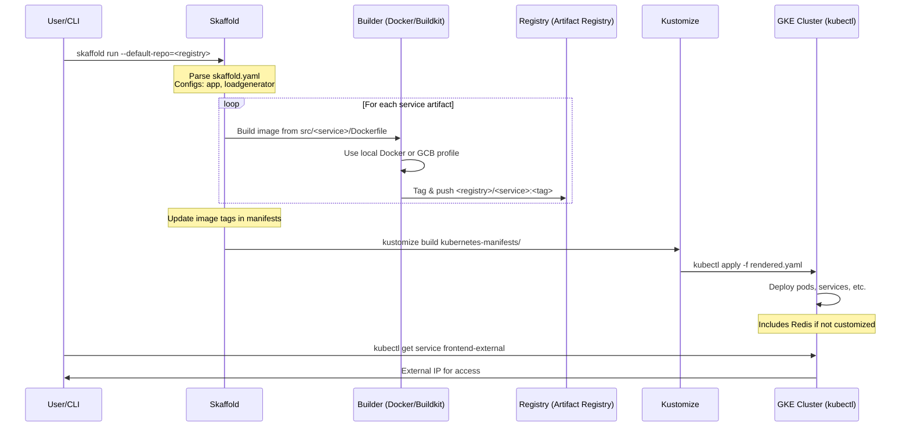
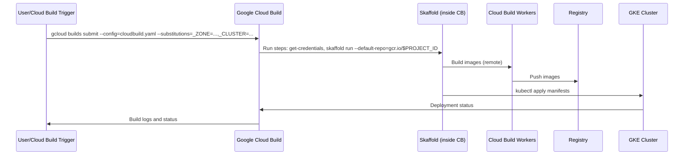

# High-Level Design of GKE Deployment Workflow

## Overview

The GKE Deployment Workflow deploys the Online Boutique microservices to a Google Kubernetes Engine (GKE) cluster using Skaffold. Skaffold orchestrates building Docker images from source code, pushing them to a container registry (e.g., Artifact Registry), rendering Kubernetes manifests with updated image tags via Kustomize, and deploying to the cluster via kubectl.

This workflow supports local execution for developers or remote execution via Google Cloud Build for CI/CD pipelines. It assumes prerequisites like an existing GKE cluster, authenticated gcloud, and a registry repository. The entry point is `skaffold run --default-repo=<registry>`, with image tags generated from git commits for versioning.

Relevant codebase elements:
- `skaffold.yaml`: Defines build artifacts, manifests, and profiles (e.g., `gcb` for cloud builds).
- `kubernetes-manifests/`: Base Kubernetes YAMLs for services, aggregated by `kustomization.yaml`.
- `cloudbuild.yaml`: Configuration for triggering the workflow in Cloud Build.
- `src/*/Dockerfile`: Build contexts for each microservice.

Post-deployment, the frontend is accessible via the external IP of the `frontend-external` LoadBalancer service.

## Components

- **Skaffold**: Core orchestrator handling build-push-deploy cycle. Configured for multi-platform builds (linux/amd64, linux/arm64), local Docker/Buildkit, or Google Cloud Build via profiles.
- **Dockerfiles**: Service-specific in `src/<service>/`, e.g., multi-stage builds for Java (adservice), Go (frontend), Node.js (currencyservice), etc.
- **Container Registry**: Stores built images; specified via `--default-repo` (e.g., `us-docker.pkg.dev/PROJECT_ID/microservices-demo`).
- **Kustomize**: Renders manifests from `kubernetes-manifests/`, allowing patches for image tags and optional components (e.g., Redis, Istio commented out).
- **Kubernetes Resources**: Deployments, Services, ConfigMaps, etc., for 10+ microservices plus Redis. LoadGenerator deployed separately via Skaffold module.
- **GKE and Tools**: GKE cluster as runtime; `gcloud` for auth/credentials; `kubectl` for apply.
- **Cloud Build**: Optional CI/CD; uses `cloudbuild.yaml` to run Skaffold in a containerized builder, specifying cluster details via substitutions.

## Direct Deployment Sequence (Local Skaffold)

This diagram illustrates the flow when running Skaffold locally against a GKE context.

## Cloud Build CI/CD Variant Sequence

For automated builds via `gcloud builds submit --config=cloudbuild.yaml`, the flow delegates building to Cloud Build.

## Additional Design Aspects

### Prerequisites
- GCP project with GKE and Artifact Registry enabled.
- `gcloud` authenticated and `kubectl` context set to GKE: `gcloud container clusters get-credentials <cluster> --zone=<zone>`.
- Docker installed locally (or use `gcb` profile).
- For Cloud Build: Service account with Kubernetes Engine Developer role; substitutions for `_ZONE` and `_CLUSTER`.

### Customization and Extensibility
- **Profiles in Skaffold**: Activate via `-p <profile>`, e.g., `-p gcb` for remote builds using Google Cloud Build, `-p debug` to enable service debugging (adds debugpy to Python images, special Dockerfile for cartservice), `-p network-policies` to patch manifests with additional Kustomize paths.
- **Kustomize Overlays**: Uncomment or add components in `kubernetes-manifests/kustomization.yaml` for features like service mesh (Istio), alternative databases (AlloyDB/Spanner), or observability (Cloud Operations).
- **Image Tagging**: Git commit-based for traceability; customizable via `tagPolicy` in `skaffold.yaml`.
- **Load Generator**: Separate Skaffold config (`loadgenerator`) requiring `app`; deploys `loadgenerator.yaml` manifest.
- **Multi-Architecture**: Builds for amd64 and arm64, useful for GKE Autopilot or diverse node pools.

### Error Handling and Best Practices
- Skaffold provides verbose logging, dry-runs (`skaffold run --dry-run`), and cleanup (`skaffold delete`).
- Monitor deployment with `kubectl get pods/services` or integrate with Cloud Operations.
- For production, combine with release workflow for tagged images and Helm/Kustomize for config management.
- Trade-offs: Local builds require significant resources; Cloud Build adds latency but scales and avoids local setup.

### Integration Points
- **Terraform Workflow**: Provisions GKE cluster beforehand.
- **Local Development**: Shares `skaffold.yaml` with `skaffold dev` for hot-reload.
- **Release Process**: Uses similar build/push logic for official images.
- **Kustomize Workflow**: Post-deploy customizations via `kubectl apply -k`.

This design promotes a seamless transition from development to GKE deployment, emphasizing automation and configurability.