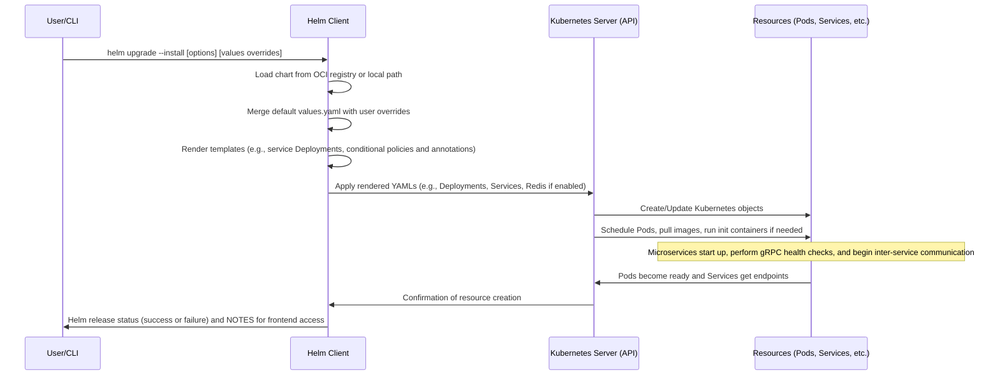
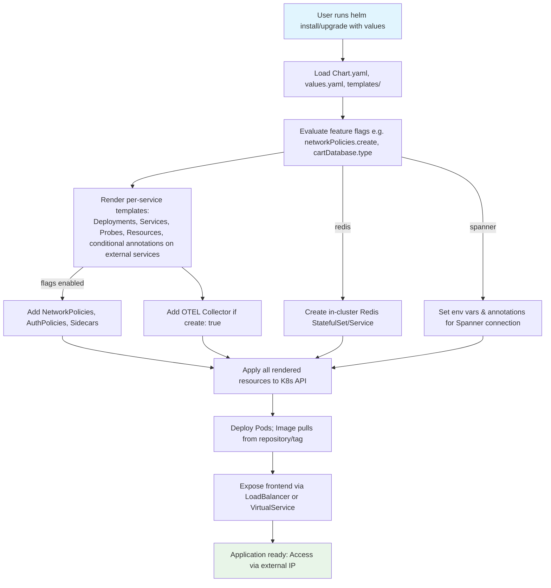

# High-Level Design: Workflow #3 - Helm Chart Deployment

## Overview

The Helm Chart Deployment workflow enables the deployment of the Online Boutique microservices application to a Kubernetes cluster using a dedicated Helm chart. This approach provides a templated and highly configurable method for managing the lifecycle of the application's components, including core microservices, load generator, optional database instances, security policies, and observability tools.

Key aspects:
- **Entry Point**: `helm-chart/Chart.yaml` – The Helm chart definition.
- **CLI Command**: `helm upgrade --install onlineboutique oci://us-docker.pkg.dev/online-boutique-ci/charts/onlineboutique` for basic deployment, with options for custom values (e.g., `--set images.repository=...`).
- **Customization**: Supports overrides for image repositories, resource limits, database types (Redis or Spanner), feature flags for network policies, Istio authorization policies, sidecars, OpenTelemetry collector, and Google Cloud Operations integrations.
- **Output**: A Helm release deploying Kubernetes resources such as Deployments, Services, ConfigMaps, and optional NetworkPolicies/AuthorizationPolicies. The frontend is exposed via a LoadBalancer service or Istio VirtualService.
- **Relevance**: Ideal for environments requiring parameterized deployments, such as production-like setups with managed databases or service mesh. Complements other workflows like Skaffold for dev or Kustomize for further customization.

The chart is marked as experimental in the README, encouraging feedback via GitHub issues. It draws from the base Kubernetes manifests but adds Helm-specific templating for flexibility.

## Components

### Helm Chart Structure
- **Chart.yaml**: Defines the chart's metadata, including name (`onlineboutique`), version (`0.10.4`), and type (`application`). No external dependencies.
- **values.yaml**: Comprehensive configuration file with defaults for:
  - Global settings: `images.repository`, service accounts creation/annotation, feature flags (e.g., `networkPolicies.create: false`, `opentelemetryCollector.create: false`).
  - Per-service configs: Resource requests/limits for each microservice (e.g., `adService.resources.requests.cpu: 200m`), enable/disable flags (`create: true`).
  - Database: `cartDatabase.type: redis` (default in-cluster Redis) or `spanner` with connection string and IAM annotations.
  - Frontend-specific: `externalService.create` (default true) for creating LoadBalancer Service with optional `externalService.annotations` map for custom metadata (e.g., external-dns integration for automatic DNS management), `virtualService.create: false` for Istio, branding (`cymbalBranding`), platform options.
  - Observability: Flags for Google Cloud Operations (tracing, metrics, profiler) and OTEL collector.
  - Security: `seccompProfile.enable: false`, `securityContext.enable: true`.
- **templates/** Directory:
  - Individual service YAMLs (e.g., `frontend.yaml`, `cartservice.yaml`): Define Deployments, Services, Probes, and environment variables.
  - `common.yaml`: Shared resources like deny-all NetworkPolicy and AuthorizationPolicy (conditional on flags).
  - `opentelemetry-collector.yaml`: Optional Deployment and ConfigMap for tracing collection.
  - `NOTES.txt`: Post-installation instructions for accessing the frontend IP.
- **README.md**: Provides basic and advanced installation examples, links to blog posts on advanced scenarios (e.g., Spanner integration, gRPC health probes).

### Deployed Resources
- **Core**: Deployments and Services for 11 microservices (adService, cartService, etc.) + loadGenerator.
- **Optional**:
  - Frontend-external LoadBalancer Service if `frontend.externalService.create: true`, supporting custom annotations (e.g., for external-dns).
  - In-cluster Redis StatefulSet if `cartDatabase.inClusterRedis.create: true`.
  - NetworkPolicies per service if enabled.
  - Istio AuthorizationPolicies.
  - Sidecars (e.g., for TLS origination to external Redis).
  - ServiceAccounts with annotations (e.g., for GCP Workload Identity).
- **Integration Points**: Supports external databases, custom images (e.g., from Artifact Registry), and Istio gateways.

## Sequence Diagrams

### Deployment Flow
This sequence diagram illustrates the high-level flow of information during the Helm-based deployment process.

### Component Creation Flowchart
This flowchart shows decision points based on values.yaml flags during template rendering and deployment.

## Other High-Level Design Aspects

### Customization Examples
- **Basic Deployment**: Uses default values; deploys all services with in-cluster Redis; frontend exposed externally.
- **Advanced with Spanner**: Set `cartservice.database.type=spanner`, provide `connectionString`, enable `serviceAccounts.create=true` with GCP IAM annotations for least-privilege access.
- **Service Mesh Integration**: Enable `authorizationPolicies.create=true`, `frontend.virtualService.create=true` with Istio gateway details.
- **Observability**: Set `opentelemetryCollector.create=true`, `googleCloudOperations.tracing=true` for metrics/traces export to Cloud Operations.
- **External DNS Management**: Configure `frontend.externalService.annotations` to add custom annotations for tools like external-dns, e.g., `--set 'frontend.externalService.annotations.external-dns\.alpha\.kubernetes\.io/hostname=onlineboutique.example.com'` for automatic DNS record creation based on LoadBalancer IP.
- **Security**: Enable `networkPolicies.create=true` for fine-grained traffic control; `seccompProfile.enable=true` for pod security.

### Flow of Information in Application
Once deployed, information flows as per the system architecture (see project-overview.md):
- User HTTP requests to Frontend → gRPC to other services (e.g., ProductCatalog, Cart, Recommendations).
- Checkout orchestrates cross-service calls for order processing.
- Cart persists to Redis/Spanner.
- LoadGenerator simulates traffic to Frontend.

Helm manages upgrades, rollouts, and hooks if defined (none explicit in current chart).

### Integration with Codebase
- Builds on `kubernetes-manifests/` and `src/*/Dockerfile` for images.
- Aligns with Kustomize components (e.g., `network-policies/`, `service-mesh-istio/`) via equivalent value flags.
- Can be used post-Terraform infrastructure provisioning (#5) or with CI/CD via Cloud Build (#6) for automated releases.
- Release process (#7) may update/publish the chart to OCI registry.

### Potential Enhancements
- Add hooks for pre/post-install (e.g., DB migration).
- Include shopping assistant service (currently missing in Helm).
- Support more DB options (e.g., AlloyDB via values).
- Validate OCI packaging for chart distribution.

This design ensures scalability, maintainability, and ease of adoption for Kubernetes users familiar with Helm.