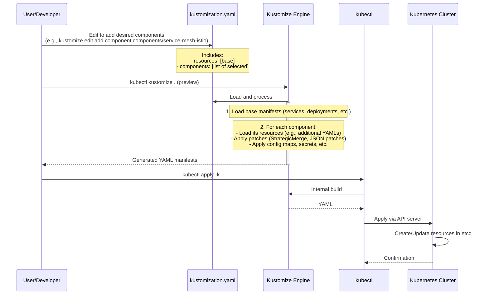
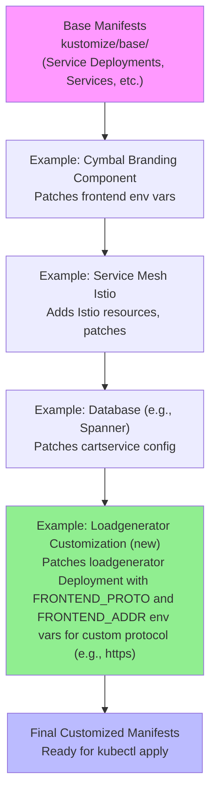

# High-Level Design of Workflow #4: Kustomize Customization and Deployment

## Overview

The Kustomize Customization and Deployment workflow enables users to deploy the Online Boutique application with highly customizable configurations using Kustomize, Kubernetes' native configuration management tool integrated into kubectl. It begins with a foundational set of Kubernetes manifests in the `kustomize/base/` directory, which define Deployments, Services, and other resources for the core microservices (e.g., frontend, cartservice, productcatalogservice). Users customize this base by composing modular **components** located in `kustomize/components/`. Each component encapsulates specific features or integrations, such as alternative persistent storage (e.g., Cloud Spanner, AlloyDB, Memorystore), service mesh (Istio), security (network policies), observability (Google Cloud Operations), branding, and more.

The workflow's high-level flow involves:
- Editing the top-level `kustomize/kustomization.yaml` to select and order components.
- Previewing generated manifests with `kubectl kustomize .`.
- Applying the customized manifests to a Kubernetes cluster using `kubectl apply -k .`.

This approach promotes declarative, GitOps-friendly deployments, allowing reproducible variations without manifest duplication. Components apply transformations like strategic merge patches, JSON patches, additional resources (e.g., CustomResourceDefinitions for Istio), and configuration injections (e.g., environment variables, secrets). Some components require prerequisite infrastructure provisioning (e.g., via Terraform or scripts for GCP services).

The design supports extensibility: new components can be added following Kustomize conventions, and tests in `kustomize/tests/` demonstrate multi-component compositions.

## Key Components

### Base Layer
- **Location**: `kustomize/base/`
- **Contents**: Individual YAML files for each microservice (e.g., `frontend.yaml`, `cartservice.yaml`) defining Deployments, Services, ConfigMaps, etc. The `base/kustomization.yaml` aggregates these as resources.
- **Role**: Provides the default, vanilla deployment of Online Boutique services, including in-cluster Redis for carts and public frontend exposure. The loadgenerator service now supports environment variables `FRONTEND_PROTO` (default: "http") and `FRONTEND_ADDR` to customize the protocol and address used for load testing the frontend, enabling scenarios like HTTPS ingress (via PR #2775 updating src/loadgenerator/Dockerfile). Components or direct patches can set these env vars in the loadgenerator Deployment.

### Top-Level Configuration
- **File**: `kustomize/kustomization.yaml`
- **Structure**:
  ```yaml
  apiVersion: kustomize.config.k8s.io/v1beta1
  kind: Kustomization
  resources:
  - base
  components:  # User-editable list, initially commented
  # - components/cymbal-branding
  # ... other components
  # Image-related components last: container-images-tag, etc.
  ```
- **Role**: Orchestrates the build process by referencing the base and applying selected components in sequence.

### Modular Components
Components are directories in `kustomize/components/` with their own `kustomization.yaml` (using `kind: Component` for reusable overlays), README.md for setup, and supporting files (patches, resources, scripts). They transform the base manifests declaratively.

List of available components:
- **alloydb**: Integrates cartservice with Google AlloyDB for PostgreSQL-based cart storage, replacing Redis. Includes patches for connection env vars and requires provisioning AlloyDB cluster, user credentials, and IAM grants.
- **container-images-registry**: Patches image pull policies to use a custom container registry (e.g., Google Artifact Registry).
- **container-images-tag**: Updates container image tags across all deployments to a specified version.
- **container-images-tag-suffix**: Appends a suffix (e.g., -v1.2) to image tags for versioning.
- **custom-base-url**: Sets a custom base path for the frontend (e.g., /online-boutique), updating routes and health checks.
- **cymbal-branding**: Applies Cymbal Shops (fictitious Google branding) by injecting `CYMBAL_BRANDING` env var into frontend Deployment.
- **google-cloud-operations**: Enables observability with Google Cloud Operations (formerly Stackdriver) by setting env vars for stats (`ENABLE_STATS`), tracing (`ENABLE_TRACING`), and profiler; deploys OpenTelemetry collector and configures workload identity.
- **memorystore**: Configures cartservice to use Google Cloud Memorystore (managed Redis) instead of in-cluster instance, patching connection details.
- **network-policies**: Deploys granular Kubernetes NetworkPolicies to restrict pod-to-pod traffic, enhancing security (e.g., deny-all baseline + allow specific flows).
- **non-public-frontend**: Removes public exposure by deleting the `frontend-external` LoadBalancer Service.
- **service-mesh-istio**: Adds Istio/Cloud Service Mesh resources (e.g., Gateway, VirtualService, egress rules for Google APIs) and patches services for mesh injection.
- **shopping-assistant**: Introduces a new `shoppingassistantservice` (Python, using Google Gemini for AI product recommendations via RAG on images), integrates with AlloyDB-backed product catalog; requires scripts for DB setup and API keys.
- **single-shared-session**: Modifies frontend to use a single shared user session (useful for demos without multi-user simulation).
- **spanner**: Swaps cartservice storage to Cloud Spanner, including database provisioning scripts, IAM setup, and connection patches.
- **without-loadgenerator**: Patches to exclude the loadgenerator Deployment and Service.

Note: Image customization components (registry, tag, suffix) should be applied last as they affect final image specs. Some components (e.g., databases, shopping-assistant) involve external GCP resource creation and may require additional tools like gcloud or Terraform.

### Tests and Examples
- **Directory**: `kustomize/tests/`
- **Purpose**: Sample kustomization.yaml files for common configurations, e.g.:
  - `service-mesh-istio-with-all-components/`: Combines cymbal-branding, google-cloud-operations, network-policies, and service-mesh-istio.
  - Similar for memorystore-with-all-components and spanner-with-all-components.
- **Usage**: Copy or reference these for quick starts with pre-validated compositions.

## Diagrams

### User Interaction and Deployment Sequence
This sequence diagram illustrates the end-to-end workflow from configuration to cluster deployment, highlighting Kustomize's role in manifest generation.



### Manifest Composition Flow
This flowchart depicts how Kustomize layers the base with components to produce final manifests. Arrows represent sequential transformations.



## Additional Design Aspects

### Customization Mechanisms
- **Patches**: Components use `patches` or `patchesStrategicMerge` to modify existing resources (e.g., update env vars in Deployments, add annotations for Istio injection).
- **Resources**: Additional YAMLs like NetworkPolicies, Istio Gateways, or new Services/Deployments (e.g., shoppingassistant).
- **Ordering**: Critical for dependencies; e.g., apply feature components before image overrides.
- **Variables and Generators**: Some use Kustomize vars or configMapGenerator for dynamic values (e.g., image tags).
- **Remote References**: Supports GitHub URLs for components, enabling external sourcing in CI/CD.

### Integration with Other Tools
- **Skaffold**: `skaffold.yaml` can target `kustomize/` for dev/deploy with hot-reload.
- **Helm**: While separate, Kustomize can post-process Helm outputs.
- **Terraform**: Used for infra (e.g., Memorystore in terraform/), then Kustomize for app manifests referencing those.
- **Cloud Build**: `cloudbuild.yaml` builds images and can run `kubectl apply -k` in pipelines.
- **kubectl Integration**: `apply -k`, `diff -k` for safe updates.

### Best Practices and Considerations
- **Order Matters**: Follow comments in kustomization.yaml for sequence (e.g., image components last).
- **Prerequisites**: Database/ GCP integrations need gcloud setup, API enables, IAM roles, and sometimes VPC peering.
- **Validation**: Use `kubectl kustomize . | kubectl apply --dry-run=client -f -` for syntax checks.
- **Rollback**: Kubernetes handles rollbacks via `kubectl rollout undo`; Git tracks config changes.
- **Scalability**: Supports namespaces, multi-cluster via additional patches.
- **Extensibility**: To add a new microservice, update base + components per `docs/adding-new-microservice.md`, then create integrating components.

This workflow exemplifies Kustomize's power for managing complex, variant-rich Kubernetes applications in a maintainable way, aligning with the project's goal of demonstrating cloud-native patterns and customizations.