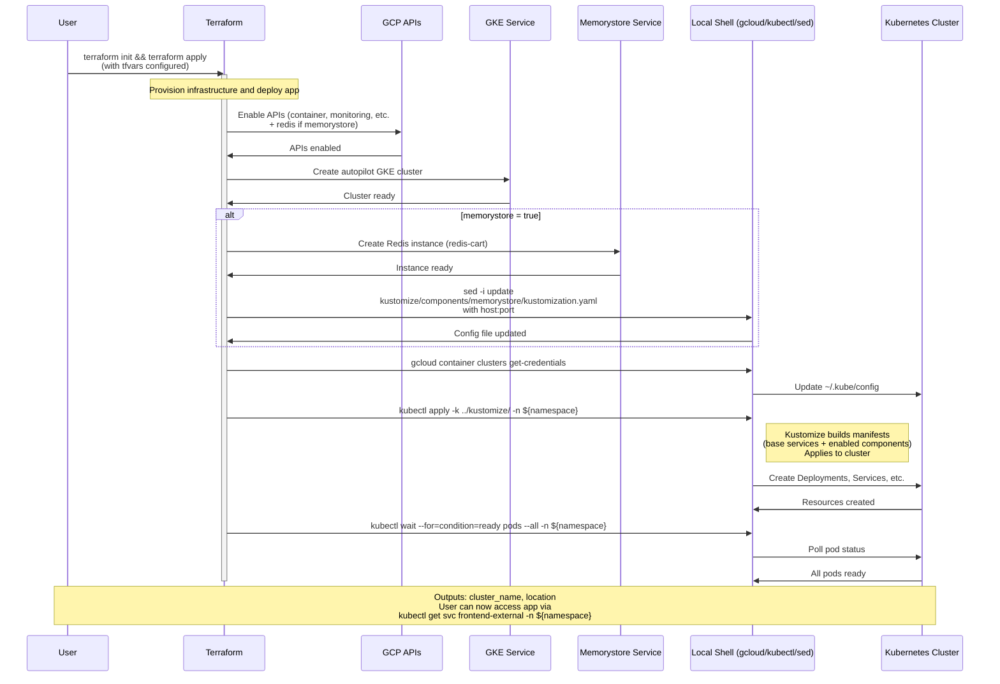

# Workflow 5: Terraform Infrastructure Provisioning

## Overview

The "Terraform Infrastructure Provisioning" workflow automates the setup of Google Cloud infrastructure for the Online Boutique microservices demo. It uses Terraform to provision a Google Kubernetes Engine (GKE) autopilot cluster, optionally a Google Cloud Memorystore for Redis instance to replace the in-cluster Redis for cart persistence, enables required GCP APIs, configures access to the cluster, and deploys the application using Kustomize-generated Kubernetes manifests.

This workflow is particularly useful for quickly spinning up a production-like environment on GCP, integrating managed services, and demonstrating infrastructure-as-code practices.

**Key Inputs:**
- `terraform.tfvars`: Set `gcp_project_id` to your GCP project ID. Optionally set `memorystore = true` to provision external Redis.
- Other variables like `region` (default: us-central1), `name` (default: online-boutique), `namespace` (default: default), `filepath_manifest` (default: ../kustomize/).

**Execution Steps:**
1. Edit `terraform.tfvars` with project ID and optional settings.
2. If using Memorystore, add the component: From `kustomize/` directory, run `kustomize edit add component components/memorystore` or manually uncomment the line in `kustomize/kustomization.yaml`.
3. `terraform init`
4. (Optional) `terraform plan` to preview changes.
5. `terraform apply` (type `yes` to confirm).

**Outputs:**
- Printed: GKE cluster name and location.
- Deployed: Microservices in specified namespace.
- Access: Run `kubectl get service frontend-external -n <namespace>` to get external IP for the app.

**Post-Deployment:**
- Frontend is exposed via LoadBalancer service.
- Use GCP Console for monitoring, or integrate with Cloud Operations via Kustomize component.
- For code changes, use Skaffold (workflow 1 or 2) or re-apply manifests.

## Components

### Core Terraform Files
- **main.tf**: Orchestrates API enabling, GKE cluster creation, credential setup, manifest application, and readiness checks using null_resources and modules.
- **memorystore.tf**: Conditionally provisions Memorystore Redis and updates Kustomize component configuration via local-exec sed command.
- **variables.tf & terraform.tfvars**: Input configuration for project, region, etc.
- **providers.tf**: Google provider setup.
- **output.tf**: Exports cluster details for scripting/integration.

### Provisioned GCP Resources
- **GKE Autopilot Cluster**: Serverless Kubernetes with automatic scaling, security, and management.
- **Enabled Services**: Essential APIs for container orchestration and observability (Container, Monitoring, Cloud Trace, Cloud Profiler); Redis API if Memorystore enabled.
- **Memorystore for Redis** (optional): Managed 1GB Redis 7.0 instance for persistent cart storage, integrated via Kustomize patch.

### Application Deployment Components
- **Kustomize (`kustomize/`)**: 
  - `kustomization.yaml`: References base manifests and enabled components.
  - `base/`: Kubernetes YAMLs for all 11 microservices + loadgenerator (supports FRONTEND_PROTO and FRONTEND_ADDR env vars for custom frontend targeting, PR #2775) and in-cluster Redis.
  - `components/memorystore/`: Patches cartservice Deployment (sets REDIS_ADDR env), deletes in-cluster Redis resources.
- **Local Executions**: 
  - `gcloud` module: Fetches cluster credentials.
  - `kubectl apply -k`: Builds and applies customized manifests.
  - `kubectl wait`: Ensures deployment health (pods ready, metrics API available).
  - `sed`: Injects dynamic Redis endpoint into static config.

### Dependencies and Prerequisites
- Terraform CLI installed.
- Google Cloud SDK (`gcloud`) authenticated and configured.
- GCP project with billing enabled and necessary quotas (e.g., for GKE clusters).
- Access to the repository's `kustomize/` directory.

## Sequence Diagram

The following Mermaid sequence diagram illustrates the high-level flow of the Terraform apply process, including the conditional Memorystore provisioning.

## Additional Design Aspects

### Memorystore Integration
- **Activation**: Set `memorystore = true` in tfvars and include `components/memorystore` in top-level kustomization.yaml.
- **Effect**: Patches cartservice to connect to external Redis, removes in-cluster Redis Deployment/Service for cleaner architecture.
- **Benefits**: Higher availability, backups, scaling independent of cluster; aligns with cloud-native managed services.
- **Requirements**: GKE cluster and Memorystore in same region/network; VPC-native GKE.

### Error Handling and Resilience
- Terraform handles dependencies (e.g., APIs before cluster).
- Null_resources use bash -exc for robust local exec.
- Wait conditions prevent premature completion if deployment fails.
- Autopilot cluster provides built-in HA and auto-repair.

### Cost and Cleanup
- **Costs**: GKE nodes (billed per usage), Memorystore (~$0.02/GB-hour), LoadBalancer, etc. Monitor via Billing.
- **Cleanup**: Edit main.tf to uncomment `deletion_protection = false`, `terraform apply`, then `terraform destroy --auto-approve`.
- **State Management**: Terraform state stored locally; use remote backend for teams.

### Extensibility
- **Custom Manifests**: Set `filepath_manifest` to alternative Kustomize overlays (e.g., `kustomize/tests/memorystore-with-all-components/`).
- **Advanced GCP Features**: Extend tf files for VPC, private cluster, Istio, etc.
- **Integration**: Outputs can feed into CI/CD (e.g., Cloud Build workflow 6) or scripts.
- **Variations**: Supports other components like AlloyDB/Spanner via similar Kustomize patterns.

### Limitations and Considerations
- **GCP-Specific**: Workflow tied to Google Cloud; no multi-cloud support.
- **Autopilot Constraints**: Limited node customization; suitable for demo but evaluate for prod workloads.
- **Public Exposure**: Frontend service is public by default; add `components/non-public-frontend` or Istio for security.
- **Version Pinning**: Uses specific provider/module versions; update carefully.
- **Apply Time**: ~10 minutes due to cluster provisioning and pod rollout.

This workflow bridges infrastructure provisioning with application deployment, leveraging Terraform's declarative model and Kustomize's customization for a flexible, GCP-optimized setup for the Online Boutique demo.