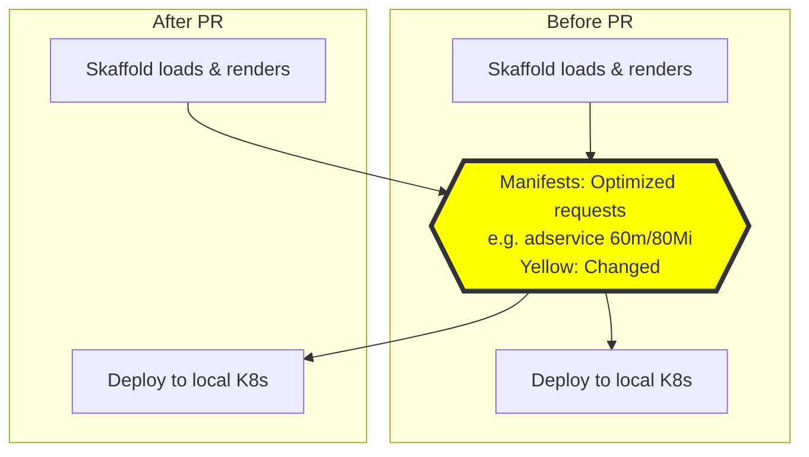
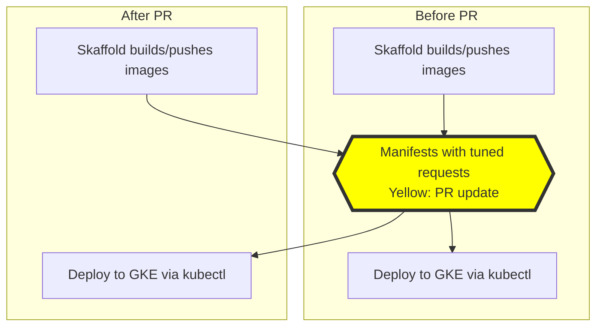
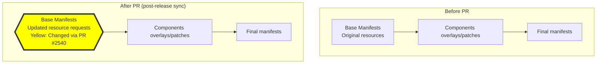

# PR #2540: Workflow Design Impact Analysis

## Affected Workflows
- **Local Development Workflow**: The PR updates resource requests in `kubernetes-manifests/*.yaml`, which are directly used by Skaffold's `dev` mode for local cluster deployments. This changes pod resource allocation during initial and hot reload deploys. Justification: `skaffold.yaml` specifies `- kubernetes-manifests`; changes affect efficiency in local environments like Minikube/Kind.

- **GKE Deployment Workflow**: Similar impact on `skaffold run` deployments to GKE, optimizing cloud resource usage. Justification: Same manifests used; both local Skaffold and Cloud Build variants affected.

- **Kustomize Customization and Deployment**: Indirect via release sync of base manifests from updated source. Justification: `docs/releasing/make-release-artifacts.sh` copies `kubernetes-manifests/*.yaml` to `kustomize/base/`, propagating changes.

- **Cloud Build CI/CD Pipeline**: Executes Skaffold via `cloudbuild.yaml`, deploying updated manifests to GKE. Justification: Cloudbuild step runs `skaffold run -f=skaffold.yaml`.

- **Release Process**: Generates updated artifacts including optimized resources in `release/kubernetes-manifests.yaml` and `kustomize/base/`. Justification: Release scripts process changed files.

No new workflows added.

## Local Development Workflow Analysis
### Summary of design changes
The PR modifies the Kubernetes manifests component by updating `resources.requests.cpu` and `resources.requests.memory` in each service's Deployment to reflect max observed usage + buffer (e.g., adservice: CPU 200m→60m, Mem 180Mi→80Mi, further refined). This affects pod specs deployed in local cluster, improving efficiency without changing workflow steps, components, or interactions. Benefits: Lower local resource demands, better scheduling. Implemented via YAML edits in PR commits, tested with Kind.

The existing sequence diagrams remain valid, but the deployed manifests now have tuned resources. Updated design docs with note on this change.

This diff highlights the modification to manifests in both initial deployment and hot reload cycles.

## GKE Deployment Workflow Analysis
### Summary of design changes
Analogous to local workflow, but for GKE deploys via `skaffold run` or Cloud Build. Updated resource requests reduce GKE costs and improve scalability. No sequence changes, but deployed resources optimized based on real deployment data. Covers both direct local Skaffold and Cloud Build variant diagrams. Design docs updated with note.

Applicable to both direct and CI/CD sequences in design doc.

## Kustomize Customization and Deployment Analysis
### Summary of design changes
The base manifests (`kustomize/base/*.yaml`) receive updates from `kubernetes-manifests/` via release process, incorporating PR's resource tuning. Affects foundational Deployments in all compositions (e.g., with Istio, databases). No change to composition flow or components, but base layer optimized. Benefits: Consistent efficiency across custom deploys post-release. Docs updated.

Diff for the manifest composition flowchart; sequence diagram's base load step similarly affected.

## Cloud Build CI/CD Pipeline Analysis
Design documentation not yet available in `.exp/`. However, as this workflow runs Skaffold within Cloud Build (per `cloudbuild.yaml`), it deploys the same updated manifests as in GKE workflow, impacting automated deployments. No structural changes to pipeline, but optimized resources in output.

## Release Process Analysis
Design documentation not yet available. The workflow's scripts now produce release artifacts with tuned resource requests, and sync to kustomize/base/. This ensures future releases and Kustomize bases reflect efficient configs. Evidence: `make-release-artifacts.sh` explicitly handles `kubernetes-manifests/*.yaml` for output generation and copying.