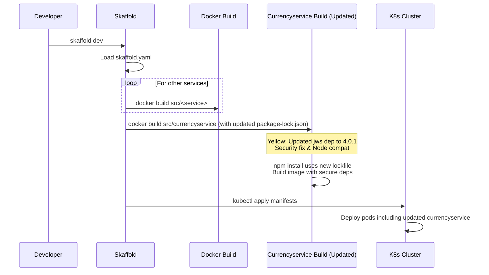
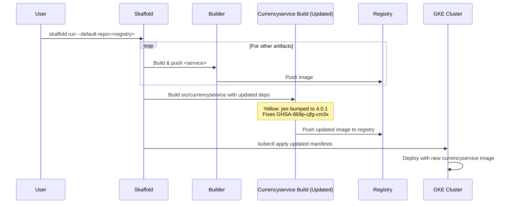

# PR #3170: Workflow Design Impact Analysis

## Affected Workflows
- **Local Development Workflow (Workflow 1)**: The PR modifies `src/currencyservice/package-lock.json`, which is part of the build context defined in `skaffold.yaml` for the currencyservice artifact. This impacts the Docker image build step during `skaffold dev`, as `npm install` in the Dockerfile will use the updated lockfile to install dependencies including the bumped `jws` version.
- **GKE Deployment Workflow (Workflow 2)**: Similarly affects the build and push steps in `skaffold run`, updating the image pushed to the registry with the new dependency version.
- **Cloud Build CI/CD Pipeline (Workflow 6)**: Involves `cloudbuild.yaml` and `skaffold.yaml`, so image builds triggered by Cloud Build will incorporate the change.
- **Release Process (Workflow 7)**: The `make-docker-images.sh` script builds Docker images for all microservices, including currencyservice from its source directory, thus affected by the lockfile update.

No other workflows are impacted, as they do not involve building or directly reference the changed file (e.g., Helm and Kustomize assume pre-built images; Terraform is infrastructure-only).

## Workflow 1 Analysis
### Summary of design changes
The PR does not introduce new steps, modify components, or change interactions in the Local Development Workflow design. However, it updates a transitive dependency (`jws`) in the currencyservice build process. Specifically, during the Docker build loop in Skaffold, the currencyservice image now includes an updated version of `jws` (4.0.1), which fixes a security vulnerability related to HMAC secret validation and improves compatibility via JWA upgrade. This is a beneficial internal change to the build artifact, enhancing security without altering the workflow sequence. Potential implications include better protection against certain attacks in dependency chain if used indirectly, though no direct usage was found in currencyservice code.

The documented design remains accurate; no updates to `.exp/design-workflow-1-local-development-workflow.md` are needed, as the high-level build step description ("Build image from Dockerfile") encompasses such dependency updates.

### Mermaid diagram showing changes to the workflow
The following diagram highlights the change in the build step for currencyservice (yellow rectangle for modified build process). The rest of the workflow is unchanged.

## Workflow 2 Analysis
### Summary of design changes
Similar to Workflow 1, the PR affects only the internal dependency resolution during the image build for currencyservice in the GKE deployment process. The Skaffold build loop now produces an image with the patched `jws` library, pushed to the registry. This minor implementation detail improves security posture for deployments to GKE without changing sequences, components, or flows in the design. No direct code changes to workflow tools (Skaffold, kubectl, etc.). Implications: Deployed instances of currencyservice will have enhanced dep security; compatible with Node 20 used in Dockerfile.

No updates needed to `.exp/design-workflow-2-gke-deployment-workflow.md`.

### Mermaid diagram showing changes to the workflow
Highlighting the modified build and push for currencyservice.

## Workflows 6 and 7 Analysis
Design documentation files (`.exp/design-workflow-6.md` and `.exp/design-workflow-7.md`) are referenced in `workflows.json` but not present in the repository. Therefore, detailed design analysis cannot be performed. However, based on descriptions and relevant files:
- **Workflow 6**: Cloud Build pipeline likely executes Skaffold or equivalent builds, so incorporates the dep update similarly to Workflows 1/2. No evidence of design change.
- **Workflow 7**: Release scripts explicitly build Docker images per service; the change affects currencyservice image tagging/pushing with updated deps. Improves release artifacts' security.

Once design docs are created, they should note that service-specific dep updates (like this PR) are handled during image builds without altering release steps.

## Overall Recommendations
- The PR is safe to merge; it provides security benefits with high compatibility.
- No updates to existing `.exp` design documents required.
- Consider documenting dependency management practices in future workflow designs, e.g., how lockfile updates propagate to images.
- Validate post-merge by building and running currencyservice image to ensure no regressions.

For full PR details, see [PR #3170](https://github.com/GoogleCloudPlatform/microservices-demo/pull/3170).