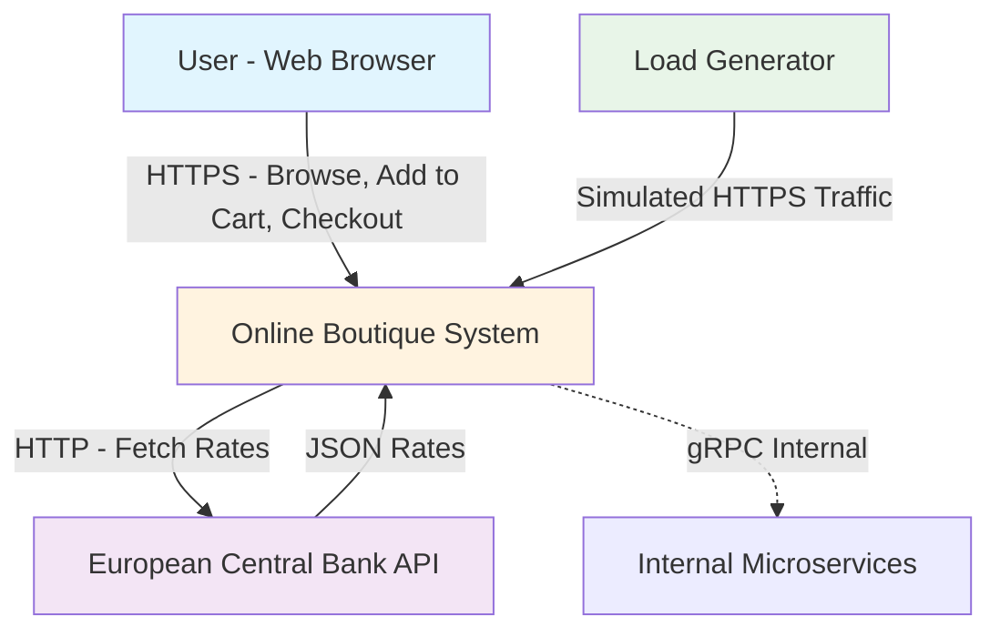
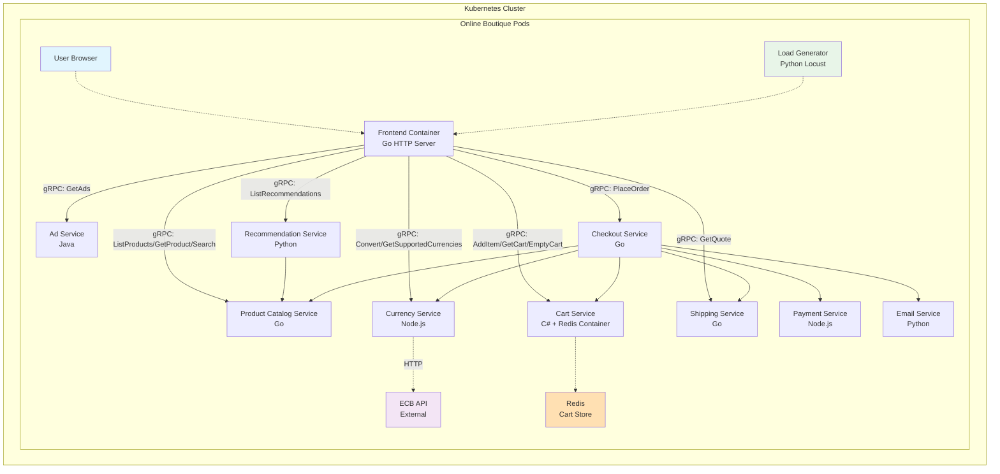

# Project Overview

## Goal

The Online Boutique is a cloud-native demo application showcasing a web-based e-commerce platform built with microservices. It allows users to browse a catalog of products, view advertisements and recommendations, add items to a shopping cart, and complete purchases through a checkout process. The primary purpose is to demonstrate modern cloud technologies including Google Kubernetes Engine (GKE), Anthos, Cloud Operations for observability, service mesh with Istio/Cloud Service Mesh, and integrations with managed services like Spanner, AlloyDB, and Memorystore for Redis. The application is designed to be deployable on any Kubernetes cluster, making it accessible for developers learning container orchestration and microservices patterns.

Key features include:
- Product browsing and search
- Shopping cart management
- Currency conversion
- Personalized recommendations and ads
- Mock payment processing, shipping quotes, and email confirmations
- Load generation for testing

The application emphasizes simplicity for beginners while providing extensibility through optional components.

## Architecture

The Online Boutique employs a microservices architecture with 11 core services (plus load generator) implemented in multiple programming languages (Go, C#, Java, Node.js, Python) to highlight polyglot support. Services communicate synchronously via gRPC using shared Protocol Buffer definitions in `protos/demo.proto`. The frontend service acts as the entry point, handling HTTP requests and user sessions (generated automatically without login). 

Internal interactions:
- Frontend interacts with most services for UI data (products, cart, ads, recommendations, currency, shipping quotes, checkout).
- Checkout service orchestrates order fulfillment by coordinating cart retrieval, product pricing, currency conversion, payment charging, shipping, and email notification.
- Cart state is managed in Redis (default), with Kustomize overlays for alternatives like Google Cloud Spanner or AlloyDB.
- Currency service fetches real-time rates from the European Central Bank (ECB).
- Other services are stateless or use local data (e.g., product catalog from JSON file).

Deployment is Kubernetes-centric:
- Base manifests in `kubernetes-manifests/` for vanilla deployment.
- Helm chart in `helm-chart/` for templated installs.
- Kustomize in `kustomize/` for base + overlays (e.g., service mesh, network policies, custom branding, Google Cloud integrations).
- Skaffold (`skaffold.yaml`) for local development and hot-reloading.
- Terraform (`terraform/` and `.github/terraform/`) for provisioning infrastructure like Memorystore (user envs) and GKE clusters for CI/production.
- Optional Istio manifests for service mesh.
- Release artifacts in `release/` for pre-built YAMLs.

The architecture supports variations like adding a Gemini-powered shopping assistant for AI-driven product suggestions based on images.

## System Context Diagram

The following Mermaid diagram represents the C4 Context level, showing the Online Boutique system and its external interactions.

- **Users** interact with the system via the web frontend.
- The **Currency Service** periodically fetches exchange rates from ECB.
- **Load Generator** simulates realistic user traffic for performance testing.
- Internal services handle all business logic within the Kubernetes cluster boundary.

## Key Components

### Core Microservices
- **Frontend (Go)**: HTTP server serving the UI (templates/static files). Routes user actions to backend services, manages sessions.
- **Cart Service (C#/.NET)**: Handles cart operations (add, get, empty) using Redis or alternative stores.
- **Product Catalog Service (Go)**: Serves product data from `products.json`, supports listing, search, and retrieval by ID.
- **Currency Service (Node.js)**: Provides currency conversion and supported currencies list; integrates with ECB for rates.
- **Payment Service (Node.js)**: Mocks credit card charging, returns transaction ID.
- **Shipping Service (Go)**: Computes shipping costs based on cart items and address; mocks order shipment with tracking ID.
- **Email Service (Python)**: Mocks sending order confirmation emails using HTML templates.
- **Checkout Service (Go)**: Central orchestrator for purchases; retrieves cart, converts currencies, charges payment, gets shipping quote, sends email, empties cart.
- **Recommendation Service (Python)**: Generates product recommendations based on cart contents.
- **Ad Service (Java)**: Provides contextual text ads based on keywords.
- **Load Generator (Python/Locust)**: Generates continuous load imitating user flows (browse, cart, checkout).

### Supporting Components
- **Redis Instance**: Default in-memory database for cart persistence (deployed as Deployment/StatefulSet).
- **Protocol Buffers**: Shared `demo.proto` defines gRPC interfaces for all inter-service communication.
- **Shopping Assistant Service (Optional, Python)**: AI service using Google Gemini to suggest products from user-uploaded images; deployed via Kustomize component.
- **Deployment Configurations**:
  - Kubernetes YAMLs for services and Redis.
  - Helm chart for parameterized deployments.
  - Kustomize bases and components for customizations (e.g., AlloyDB/Spanner for cart, Istio service mesh, network policies, Cloud Operations for tracing/metrics).
  - Skaffold for local dev clusters (e.g., Docker Compose, Minikube).
  - Terraform for GCP resources like Memorystore.

### Observability and Tooling
- Supports OpenTelemetry for tracing.
- Health checks via gRPC health protocol.
- Logging with structured formats (e.g., JSON).

## Container Diagram

The following Mermaid diagram approximates the C4 Container level, depicting key containers (services/pods) and their interactions within the Online Boutique system. Arrows represent gRPC calls (synchronous).

- **Containers** are Dockerized services deployed as Kubernetes Deployments (some StatefulSets like Redis).
- **Interactions**: Primarily gRPC between services; frontend handles HTTP/JSON to/from browser.
- **Data Flows**: Cart persists to Redis; products from static JSON; currency rates cached from ECB.
- **Orchestration**: Checkout acts as a saga orchestrator for distributed transactions (no ACID, uses compensation if failures).
- Note: Full graph includes health checks and optional tracing spans.

## Design Decisions

### Microservices and Communication
- **Polyglot Implementation**: Services in diverse languages (5 languages) to demonstrate Kubernetes and gRPC's multi-language capabilities. Trade-off: Builds toolchain complexity but educates on interoperability.
- **gRPC over REST**: Chosen for performance (binary, HTTP/2 multiplexing, streaming support) and schema enforcement via Protobufs. Enables easy client generation across languages. Trade-off: Steeper learning curve vs. JSON/REST familiarity.
- **Synchronous Communication**: All inter-service calls are RPCs; no event-driven (e.g., Pub/Sub) to keep simplicity. Trade-off: Potential cascading failures, mitigated by timeouts/retries in clients.

### Data and State Management
- **Redis for Cart**: Fast, in-memory for session data; ephemeral for demo simplicity. Kustomize components allow swapping to persistent managed DBs (Spanner, AlloyDB) for production-like resilience. Trade-off: Data loss on pod restart in default setup.
- **Static Data**: Product catalog and ad data from files/configs to avoid external DB dependency in core demo.
- **Mock External Services**: Payment, email, shipping are mocks to focus on internal architecture without real integrations. Trade-off: Not production-ready, but simplifies onboarding.

### Deployment and Operations
- **Kubernetes-First**: All manifests provided for easy `kubectl apply`; supports any K8s distro (GKE, Minikube, kind). Trade-off: Assumes K8s knowledge, but aligns with demo goal.
- **Kustomize for Customization**: Base deployment + modular overlays (e.g., `network-policies/`, `service-mesh-istio/`, `google-cloud-operations/`) enable feature toggles without forking. Trade-off: Learning Kustomize, but promotes declarative config.
- **Service Mesh Optional**: Istio/Cloud Service Mesh via component for traffic management, security, observability. Trade-off: Adds overhead/complexity, enabled only when needed.
- **Observability Integration**: OpenTelemetry collector configurable; ties into Cloud Operations (tracing, metrics, logs). Trade-off: Requires setup, but showcases SRE practices.
- **Simplicity vs. Extensibility**: Core app keeps minimal steps for quickstart (e.g., no auth, pre-filled forms); advanced features (AI assistant, custom DBs) as opt-in. Ensures beginner-friendly while supporting advanced demos.
- **Versioning and Releases**: Semantic versioning, release scripts in `docs/releasing/` for Docker images, Helm charts, manifests.

### Trade-offs and Rationale
- **Demo Focus**: Prioritizes educational value over production robustness (e.g., no real security, error handling simplified). Purpose: Teach microservices/K8s patterns.
- **Cloud-Agnostic Core**: Runs on local clusters; GCP integrations optional via components to broaden accessibility.
- **Scalability**: Designed for horizontal scaling; load generator tests it. High-QPS currency service highlights performance considerations.

This overview captures the essence of the codebase; refer to README.md, docs/, and source code for deeper details.
