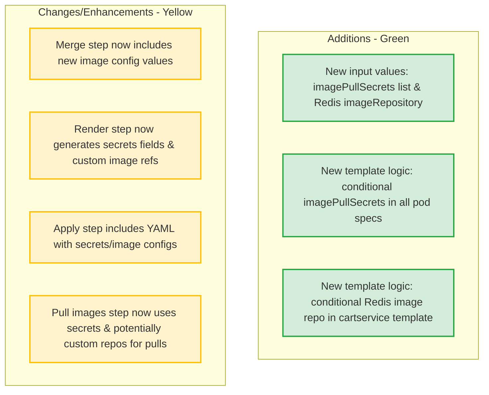
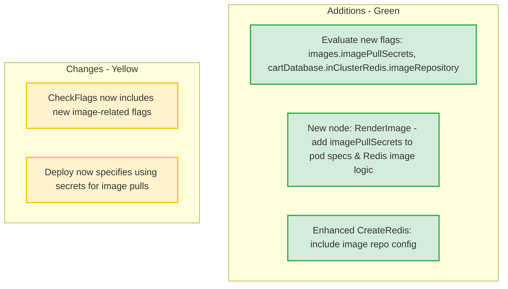

# PR #2760: Workflow Design Impact Analysis

## Affected Workflows
- **Workflow 3 - Helm Chart Deployment**: The PR directly modifies `helm-chart/values.yaml` and multiple templates in `helm-chart/templates/`, which are the primary files for this workflow. These changes introduce new configuration options for image pulling, impacting how deployments handle container images.
- **Workflow 7 - Release Process**: Although not directly listed in relevant_files, the release script `docs/releasing/make-helm-chart.sh` packages the entire `helm-chart/` directory into an OCI artifact. Changes to templates and values affect the released Helm chart version.
- **Workflow 8 - Adding New Microservice**: This workflow requires updating the Helm chart (step 7 in `docs/adding-new-microservice.md`). The PR's additions to templates (e.g., imagePullSecrets blocks) provide a model for new service templates and enhance configurability for image sources in new services.

No other workflows are affected, as their relevant files (e.g., skaffold.yaml, kustomize/, terraform/) remain unchanged, and the PR is scoped to Helm-specific configurations.

## Workflow 3 Analysis
### Summary of design changes
The PR adds support for Kubernetes `imagePullSecrets` across all microservice deployments and the optional Redis StatefulSet, enabling pulls from private registries or proxy caches. It also introduces a dedicated `imageRepository` for the cart service's Redis image to handle Docker Hub mirroring separately from the global GCR-based repository.

- **Affected aspects**: Configuration in `values.yaml` (new fields under `images` and `cartDatabase.inClusterRedis`), template rendering logic (conditional `imagePullSecrets` in pod specs, extended image selection for Redis).
- **Implementation**: Global list of secrets rendered via Helm templating into every pod template; Redis image uses priority: custom repo > global repo > public Docker Hub sha if `publicRepository: true`.
- **Benefits**: Improves deployability in secured environments (e.g., enterprise clusters with internal registries), reduces external dependencies, no breaking changes (options default to empty/off).
- **Implications**: Users must provision secrets in the target namespace; future releases include these features; aligns with K8s best practices for image security.

The design document `.exp/design-workflow-3-helm-chart-deployment.md` has been updated to document these changes in sections on values.yaml, deployed resources, customization examples, and both Mermaid diagrams (sequence and flowchart) to reflect new configuration and rendering steps.

### Changes to Deployment Flow Sequence Diagram
This diagram highlights additions (green) and changes (yellow) from the PR in the original sequence diagram.

### Changes to Component Creation Flowchart
This diagram shows additions and changes to the original flowchart.

## Workflow 7 Analysis
### Summary of design changes
Changes to `helm-chart/` indirectly affect this workflow, as the Helm chart is built, versioned (via Chart.yaml updates in script), packaged, and pushed to OCI registry during release. The new options will be part of future releases, allowing downstream users to leverage private image support without manual patches.

No design document exists in `.exp/` for this workflow, so no diagrams updated. The core release steps remain unchanged, but the artifact now includes enhanced configurability.

No Mermaid diagrams to update.

## Workflow 8 Analysis
### Summary of design changes
When adding a new microservice, step 7 involves creating/updating Helm templates and values for the new service. The PR demonstrates adding `imagePullSecrets` to pod specs and provides a pattern for handling special image sources (like the Redis example), which new services can adopt for consistency.

No design document exists in `.exp/` for this workflow (though operational guide in `docs/adding-new-microservice.md`). Thus, no diagrams updated, but future integrations benefit from the enhanced chart structure.

No Mermaid diagrams to update.

[PR #2760](https://github.com/GoogleCloudPlatform/microservices-demo/pull/2760)