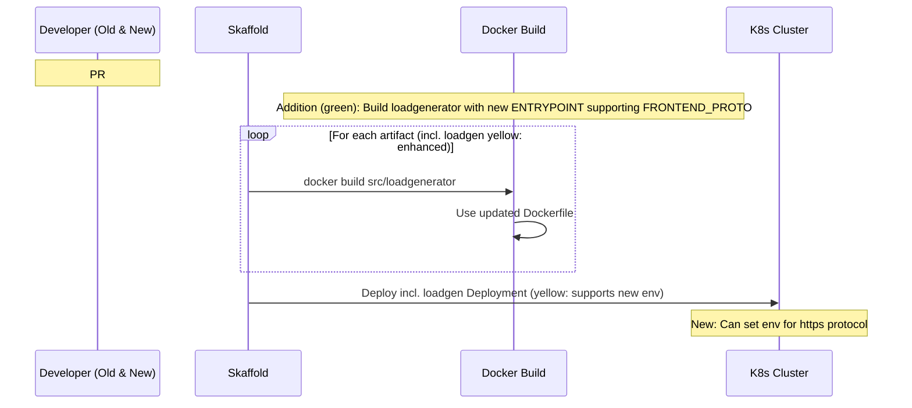
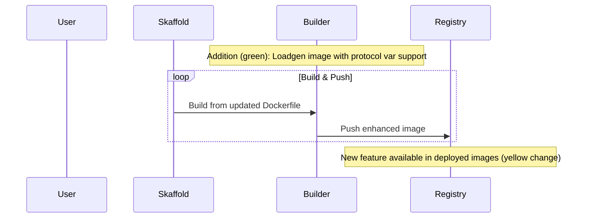
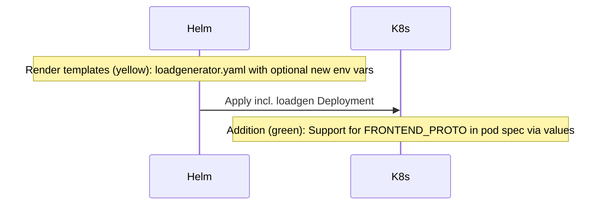
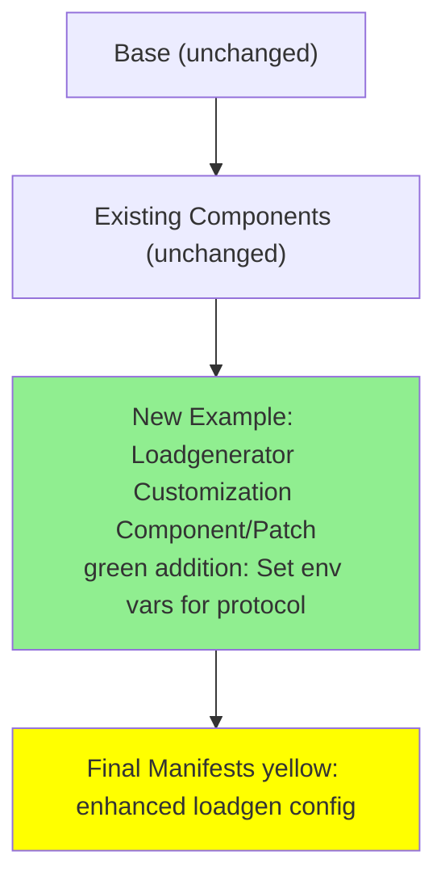

# PR #2775: Workflow Design Impact Analysis

## Affected Workflows
- **Local Development Workflow (1)**: Impacted because Skaffold builds the loadgenerator image from the updated `src/loadgenerator/Dockerfile` during `skaffold dev`, and deploys `loadgenerator.yaml`. The new env var support enables customized local load testing. Evidence: workflows.json relevant_files; PR changes Dockerfile used in build loop.
- **GKE Deployment Workflow (2)**: Skaffold `run` builds and pushes the updated image to registry for GKE deployment. New feature allows protocol customization in GKE setups with ingress. Evidence: similar to workflow 1; separate loadgenerator config in skaffold.yaml.
- **Helm Chart Deployment (3)**: Helm chart templates include `loadgenerator.yaml`, using the image with new ENTRYPOINT logic. Can be configured via values for env vars. Evidence: helm-chart/templates/loadgenerator.yaml exists; design doc updated to note.
- **Kustomize Customization and Deployment (4)**: Base includes `loadgenerator.yaml`; PR testing procedure explicitly uses Kustomize patch to set new env vars in loadgenerator Deployment. Enables new component-like customizations. Evidence: PR description; kustomize/base/loadgenerator.yaml.
- **Terraform Infrastructure Provisioning (5)**: Indirect impact as it provisions infra for subsequent app deployment using base manifests with loadgenerator. Design doc mentions it in base. Evidence: doc reference.
- **Cloud Build CI/CD Pipeline (6)**: Uses cloudbuild.yaml and skaffold to build images including loadgenerator, affected by Dockerfile change. No design doc yet.
- **Release Process (7)**: Builds tagged images and updates release manifests including loadgenerator. Dockerfile change affects released image. No design doc yet.
- **Adding New Microservice (8)**: Updates to skaffold, kustomize, helm would need to account for loadgenerator changes when integrating new services, but primarily affects existing loadgen. No design doc yet.

## Local Development Workflow (1) Analysis
### Summary of design changes
The PR introduces support for customizing the frontend protocol in the loadgenerator by adding `${FRONTEND_PROTO:-http}` to the locust --host in Dockerfile ENTRYPOINT. This allows setting env var in deployment manifests or Skaffold profiles for flexible load testing (e.g., https for local ingress simulations). Implemented via shell variable in ENTRYPOINT. Benefits: Enhances local dev realism for secure setups; backwards compatible. Implications: Update manifests or use profiles to leverage; hot reload now rebuilds with new logic.

The initial deployment sequence diagram was updated with new notes highlighting the change (additions in green via notes).

## GKE Deployment Workflow (2) Analysis
### Summary of design changes
Similar to workflow 1, but for GKE with image push. New image pushed to registry includes the customization, allowing GKE deployments to configure loadgen for external HTTPS frontends. Implemented same way. Benefits: Supports production-like load testing in GKE. Updated diagram notes reflect build/push enhancement.

## Helm Chart Deployment (3) Analysis
### Summary of design changes
Helm renders loadgenerator template using image with new feature. Design updated to note config via values. Allows setting env vars in values.yaml for protocol. Benefits: Parameterized deploys with load testing customization. No structural change to flow, but enhanced capability.

## Kustomize Customization and Deployment (4) Analysis
### Summary of design changes
Enables new patches for loadgenerator Deployment to set FRONTEND_PROTO and FRONTEND_ADDR, as demoed in PR. Base role and composition flowchart updated to include example customization component/patch for protocol. How: Image ENTRYPOINT change allows env-driven host. Benefits: Better ingress/HTTPS support in customized deploys. Implications: Can create component for it.

Updated flowchart shows addition of Loadgenerator Customization example in green.

## Other Workflows
For workflows 5-8, no design documents were available for detailed analysis or updates, but they are impacted similarly through image builds or manifest updates including loadgenerator. Recommend creating design docs for comprehensive coverage.

[PR #2775](https://github.com/GoogleCloudPlatform/microservices-demo/pull/2775)