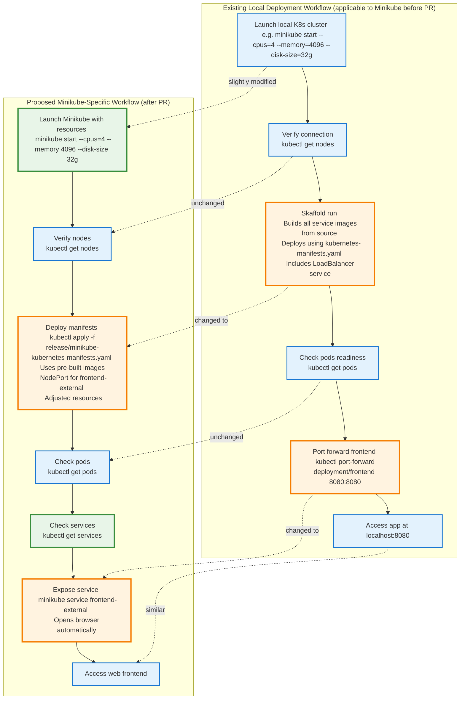

# PR #2796: Workflow Design Impact Analysis

## Affected Workflows
- **Local Development Workflow**: This workflow is described in `docs/development-guide.md` under "Option 2 - Local Cluster". The PR updates the steps for Minikube deployment, adding a dedicated manifest file `release/minikube-kubernetes-manifests.yaml` and altering the process to improve compatibility and ease of use without needing to build images locally. Justification: The changed file `docs/development-guide.md` directly modifies the instructions for local cluster setup, specifically enhancing Minikube support, and the new manifest is referenced in those instructions. See [PR #2796](https://github.com/GoogleCloudPlatform/microservices-demo/pull/2796) for details.

No other workflows are impacted. Note: The repository does not contain `.exp/workflows.json` or `.exp/design-workflow-*.md` files as assumed in the analysis template, so workflows are inferred from relevant documentation (e.g., development guide describing key processes).

## Local Development Workflow Analysis
### Summary of design changes
The PR affects the local development workflow for Minikube by introducing a specialized deployment method optimized for this environment. Previously, users followed a uniform process using Skaffold for all local clusters (Minikube, Kind, Docker Desktop), which involved building Docker images from source and deploying manifests assuming cloud-like features (e.g., LoadBalancer services). The changes streamline Minikube setup:

- **New components added**: `release/minikube-kubernetes-manifests.yaml` – a comprehensive Kubernetes manifest including all microservices (Deployments, Services, ServiceAccounts), using pre-built images from `us-central1-docker.pkg.dev/google-samples/microservices-demo/:v0.10.2`, with frontend-external service changed to `NodePort` for Minikube compatibility, and comments suggesting reduced CPU/memory resources to fit local constraints.
- **Steps modified**: In `docs/development-guide.md`, the Minikube subsection now instructs `kubectl apply -f ./release/minikube-kubernetes-manifests.yaml` instead of `skaffold run`, bypassing image builds (previously ~20 minutes). Adds verification of services and uses `minikube service frontend-external` for automatic browser access, replacing manual port-forward.
- **Other updates**: Separates instructions for Minikube and Kind (Kind retains Skaffold); removes Docker Desktop guidance (likely as it's similar to Minikube); explains changes like service type adjustments.

These implement a quicker, non-development (demo/testing-focused) path for Minikube, decoupling it from source code builds.

**Potential benefits**: Reduced setup time and complexity for quick local demos/testing; better resource efficiency; native tool integration (minikube service).
**Implications**: For active development with code changes, Skaffold is still needed separately; relies on specific image tags (may lag behind latest code); potential need for users to enable Minikube addons if any; differentiates workflows per local tool.

The documentation (`docs/development-guide.md`) describes the workflow textually but contains no Mermaid diagrams. Thus, no existing diagrams require updates. For illustration, the following diagram shows the key differences in the Minikube deployment flow:

- **Green rectangles (additions)**: New steps like checking services and using Minikube-specific launch/resources.
- **Yellow rectangles (changes)**: Updated deployment (apply vs skaffold), exposure (service vs port-forward).
- **No red rectangles (removals)**: Old Skaffold approach remains viable for other locals or full dev cycles, but replaced for Minikube quick-start.

No updates to `.exp` design documents are needed, as none exist and changes are already incorporated into `docs/development-guide.md` by the PR.