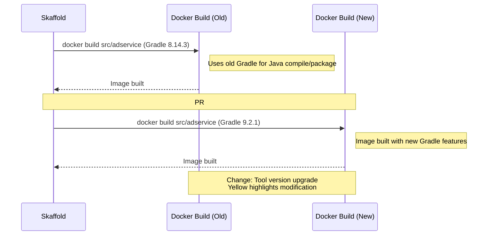

# PR #3053: Workflow Design Impact Analysis

## Affected Workflows
- **Local Development Workflow** (Workflow 1): The PR updates the Gradle wrapper in \`src/adservice/gradle/wrapper/gradle-wrapper.properties\` to version 9.2.1. This file is used during the Docker image build for the adservice microservice, which is triggered by Skaffold in this workflow. Evidence: \`skaffold.yaml\` defines artifact for adservice with context \`src/adservice\`; Dockerfile executes \`./gradlew installDist\`.

- **GKE Deployment Workflow** (Workflow 2): Similar to Workflow 1, Skaffold \`run\` builds and pushes images, including adservice using the updated Gradle version.

- **Cloud Build CI/CD Pipeline** (Workflow 6): \`cloudbuild.yaml\` executes Skaffold \`run\`, which builds adservice image using the Gradle wrapper.

- **Release Process** (Workflow 7): \`docs/releasing/make-docker-images.sh\` changes to \`src/adservice\` and runs \`gcloud builds submit\`, which builds the Dockerfile invoking the Gradle wrapper.

## Local Development Workflow Analysis
### Summary of design changes
The PR performs a major upgrade of Gradle from 8.14.3 to 9.2.1 specifically for the adservice build process. This impacts the internal execution of the Docker build step within Skaffold's workflow, as the adservice Dockerfile runs \`./gradlew installDist\` to compile and package the Java application. Key implications from Gradle 9 release notes include:

- Gradle now requires JVM 17 or higher to run (satisfied by adservice's build stage using OpenJDK 21).
- Configuration cache is now the recommended and default execution mode for improved performance.
- Build scripts are updated to use Kotlin DSL 2.2 and Groovy 4.0.
- New features like full Java 25 support (used in runtime stage), native task graph visualization, enhanced console output.

No structural changes to the workflow sequence or components; the high-level design remains intact. Potential benefits: faster builds, better error guidance, Windows ARM support (if relevant). Implications: Developers building adservice locally or in pipelines must have compatible Java; any deprecated features in build.gradle may need addressing (current build.gradle uses protobuf plugin v0.9.5, which should be verified for compatibility). No immediate breaking changes observed, but consult [Gradle 9.x upgrade guide](https://docs.gradle.org/9.2.1/userguide/upgrading_version_9.html).

The existing Mermaid diagrams do not detail specific tool versions or internal build mechanics, so they do not require updates. However, for clarity, here's a supplementary diagram highlighting the change in the build component:


```

### [PR #3053](https://github.com/GoogleCloudPlatform/microservices-demo/pull/3053)

## GKE Deployment Workflow Analysis
### Summary of design changes
Similar to Local Development, the upgrade affects the build phase in both direct (local Skaffold run) and Cloud Build variant sequences. The push to registry step remains unchanged, but the built image for adservice now incorporates artifacts from Gradle 9. This could improve build efficiency in cloud environments but requires ensuring pipeline Java environments meet new requirements. No changes to deployment or manifest rendering steps.

The existing diagrams are unaffected structurally. The supplementary diff diagram above applies similarly to the build loops shown in the GKE workflow diagrams.

## Cloud Build CI/CD Pipeline Analysis
No dedicated design document found for this workflow (.exp/design-workflow-6.md missing). However, the workflow is impacted as \`cloudbuild.yaml\` invokes Skaffold \`run\`, mirroring the build process in Workflows 1 and 2. The change enhances the automated build step in CI/CD but may require verifying Cloud Build's Java runtime compatibility (Cloud Build uses containerized environments with configurable JDK versions). Potential benefit: Leverages Gradle's improved publishing APIs for better artifact handling during image pushes.

No Mermaid diagrams to update.

## Release Process Analysis
No design document found (.exp/design-workflow-7.md missing). The impact is on the image building step in \`make-docker-images.sh\`, where \`gcloud builds submit\` in adservice directory builds the image using the updated Gradle wrapper. This affects release artifact creation for tagged images pushed to registries. Since releases are for public consumption, the upgrade ensures a modern, secure build tool. Consult [Gradle release notes](https://docs.gradle.org/9.2.1/release-notes.html) for migration details.

No diagrams to update.

**Overall**: The PR introduces an implementation change to the build tooling for one microservice (adservice), affecting multiple workflows that involve image building. No updates to existing design documents or diagrams are necessary, as versions are not documented. The change aligns with maintenance best practices for dependency updates [as per PR description](https://github.com/GoogleCloudPlatform/microservices-demo/pull/3053)."
<parameter name="replace_all">false