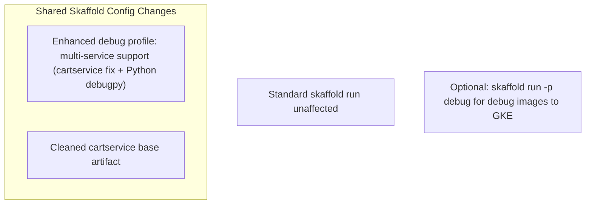
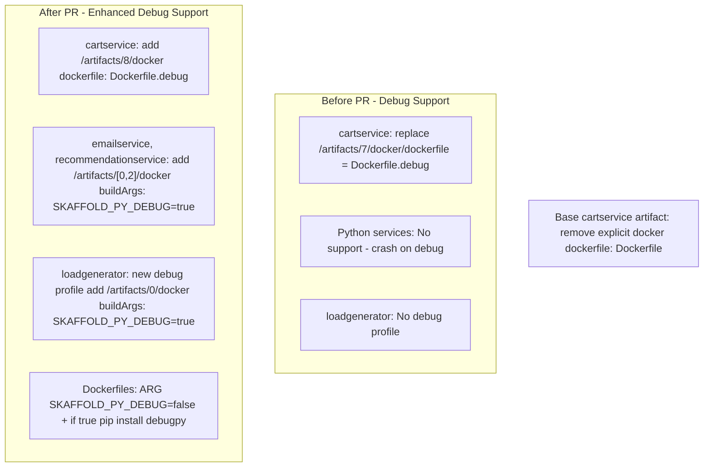

# PR #3094: Workflow Design Impact Analysis

## Affected Workflows
- **Local Development Workflow**: Directly impacted as the PR fixes and extends the `debug` profile documented in its design for `skaffold debug`, enabling debugging for additional services.
- **GKE Deployment Workflow**: Indirectly impacted through shared `skaffold.yaml`; the enhanced `debug` profile can be optionally used with `skaffold run -p debug`.

## Local Development Workflow Analysis
### Summary of design changes
The PR enhances the debugging capabilities in the local development workflow by correcting the cartservice debug Dockerfile override and adding support for Python services and loadgenerator.

Specific aspects affected:
- Skaffold `debug` profile patches: Extended to include build args for Python services to install `debugpy`, and added profile to loadgenerator config.
- Dockerfiles for emailservice, recommendationservice, loadgenerator: Added conditional `debugpy` installation based on build arg.
- cartservice: Fixed patch and added/updated Dockerfile.debug.
- Base skaffold.yaml: Removed explicit Dockerfile for cartservice to avoid conflicts.

The PR implements these via Skaffold JSON patches activated on `debug` command and Dockerfile ARGs/RUN conditions.

Benefits: Fixes crashes in debug mode for Python services, enables IDE debugging for more services, improves local dev experience.
Implications: Debug builds include extra dependencies; standard dev unaffected.

## GKE Deployment Workflow Analysis
### Summary of design changes
The PR updates `skaffold.yaml`, which is central to this workflow, primarily enhancing the optional `debug` profile:

- Extended `debug` profile now supports Python services and loadgenerator alongside fixed cartservice support, available for use with `skaffold run -p debug --default-repo=<registry>`.
- Minor config cleanup for cartservice base artifact.
- Dockerfiles updated to support debug builds universally.

Specific aspects: Profiles section in design doc now should include `debug` as an example alongside `gcb` and `network-policies`.

How PR implements: Same Skaffold patches and Dockerfile changes.

Benefits: Allows debugging deployments to GKE for services under test. Implications: Not standard for production deploys; debug features may not be suitable for GKE security contexts.



## Design Document Updates Performed
- Updated `.exp/design-workflow-1-local-development-workflow.md`: Enhanced descriptions of `debug` profile and patches; updated Initial Deployment sequence diagram to illustrate debug variant.
- Updated `.exp/design-workflow-2-gke-deployment-workflow.md`: Added mention of `debug` profile in customization examples.
- All updated Mermaid diagrams validated with `mmdc` for syntax correctness.

```



