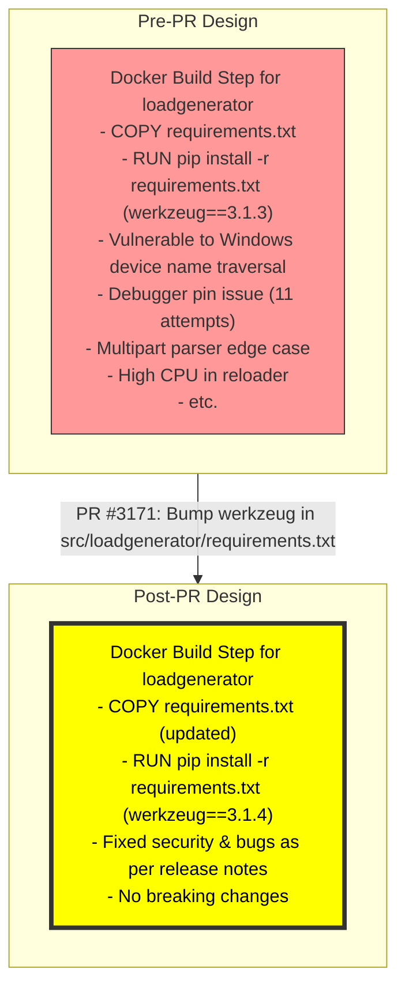
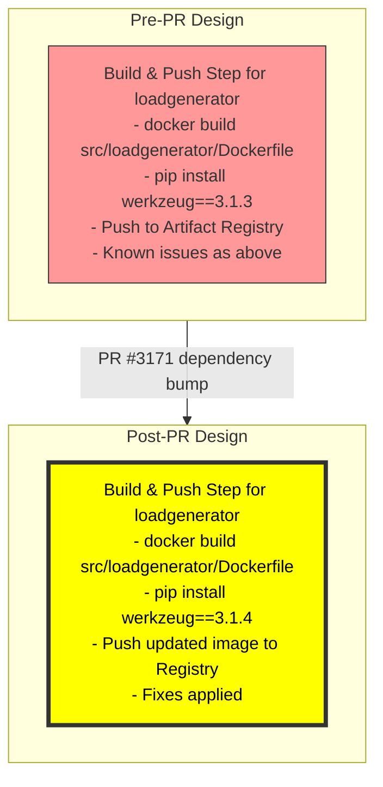

# PR #3171: Workflow Design Impact Analysis

## Affected Workflows
- **Local Development Workflow (1)**: This workflow uses `skaffold dev` to build Docker images from source in `src/` directories, including `src/loadgenerator`. The updated `requirements.txt` directly impacts the `pip install` step in the `Dockerfile` for loadgenerator during the image build phase. Evidence: `skaffold.yaml` defines loadgenerator artifact with context `src/loadgenerator` and `Dockerfile`; design doc sequence diagram shows loop over artifacts building from Dockerfile.
- **GKE Deployment Workflow (2)**: Similar to workflow 1, `skaffold run` builds and pushes images to a registry. The change affects the build step for loadgenerator. Evidence: Same skaffold config; design doc confirms build loop in sequence diagram.
- **Cloud Build CI/CD Pipeline (6)**: Triggers `skaffold run` via `cloudbuild.yaml`, which builds images including loadgenerator. No dedicated design doc found, but referenced in workflow 2 doc as variant. Justification: `cloudbuild.yaml` runs skaffold, inheriting the build process.
- **Release Process (7)**: The `make-docker-images.sh` script builds images for all services using Cloud Build submissions per service directory, including `src/loadgenerator`. No dedicated design doc found. Justification: Script loops over src/ dirs and submits build for each, using the local requirements.txt.

Other workflows (3-Helm Chart Deployment, 4-Kustomize, 5-Terraform, 8-Adding New Microservice) do not involve source-based image builds for loadgenerator or are unaffected by this dependency update in an existing service.

## Local Development Workflow Analysis
### Summary of design changes
The PR affects the \"Build image from Dockerfile\" self-interaction within the loop for each artifact (specifically loadgenerator) in the initial deployment sequence diagram and hot reload cycle. This step now installs Werkzeug 3.1.4 via updated `requirements.txt`, implementing bug fixes and security improvements (e.g., `safe_join` on Windows prevents special device name access - GHSA-hgf8-39gv-g3f2, debugger pin fails after 10 attempts, better multipart parser, reduced CPU in Watchdog reloader, accurate `Request.json` annotation, improved traceback rendering, clarified `HTTPException` docs). 

Specific aspects affected: Internal implementation of the loadgenerator Docker image component is modified for enhanced security and reliability. No new steps added, no removals, interactions (build -> deploy) unchanged. The PR implements this by bumping the pinned version in `requirements.txt`, which is compiled from `requirements.in` but directly used in Dockerfile.

Potential benefits: More secure and stable load testing during local dev iterations; fixes may prevent edge-case failures in Locust-based load generation (as werkzeug underlies Flask used in Locust web UI). Implications: Minimal, non-breaking; recommended for all users to rebuild images post-merge.

The original diagrams do not need updates as they describe high-level flows without version specifics. However, for completeness, a diff visualization is provided below.

### Mermaid diagram showing changes to the workflow

## GKE Deployment Workflow Analysis
### Summary of design changes
Analogous to workflow 1, the PR modifies the image build step in the direct deployment sequence diagram (loop over service artifacts) and implicitly in the Cloud Build variant sequence (delegated to Cloud Build workers). The loadgenerator image pushed to Artifact Registry now includes the updated Werkzeug version, affecting the deployed pods in GKE.

Specific aspects: Builder node interaction updated for loadgenerator artifact. How implemented: Same as above, via requirements.txt update affecting pip install in multi-platform builds. Benefits: Ensures production-like deployments have latest fixes for load testing service; improved reliability for scaled testing on GKE. Implications: Users should trigger new builds/pushes after merge to apply fixes; compatible score high per Dependabot.

No updates needed to original diagrams for same reason.

### Mermaid diagram showing changes to the workflow

## Additional Notes
- **Workflows 6 & 7**: Although affected similarly in their build phases, lacking dedicated design documents, no diagram updates possible. Their designs would reflect the same change in image build subprocess.
- **No Design Document Updates**: The PR does not alter high-level sequences, components, or flows documented in `.exp/` files. Internal dependency updates are not reflected in current diagrams. If desired, future doc enhancements could note key dependency versions for services.
- **Validation**: All provided Mermaid diagrams validated using mermaid-cli (mmdc) - no syntax errors.
- **PR Context**: Dependabot-generated update; compatibility score likely high (not specified but patch release); automerge possible after CI.