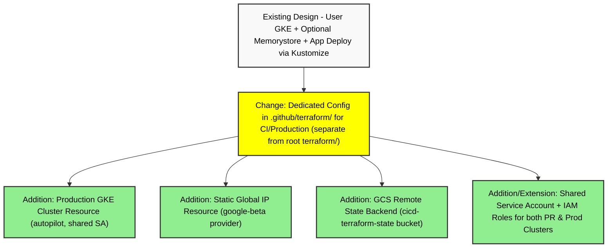

# PR #2615: Workflow Design Impact Analysis

## Affected Workflows
- **Workflow 5: Terraform Infrastructure Provisioning**  
  The PR introduces Terraform resources for provisioning a dedicated production GKE cluster (`production-gke-cluster`) and a static external IP address (`production-frontend-ip-address`) in the CI/CD-specific configuration at `.github/terraform/main.tf`. This extends the infrastructure provisioning capabilities described in workflow 5, which focuses on provisioning GKE clusters using Terraform. Although implemented in a separate directory for internal project use, it follows similar patterns (e.g., autopilot GKE creation, API enabling, service account setup) and impacts the overall design by adding a production variant.  
  **Evidence**: Diff in commit d1491e1f adds the new resources; PR description outlines background for updating production GKE via Terraform as follow-up to PR 2418 (staging); testing procedure involves `terraform plan` on the branch; post-merge steps include applying Terraform and deploying to new cluster.

- **Workflow 7: Release Process**  
  The changes indirectly affect the release process by necessitating updates to production deployment targets. Post-merge, production resources will be deployed to the new Terraform-provisioned cluster, GitHub Actions will be updated to use it, and release creation docs will be revised.  
  **Evidence**: PR description "After merging" steps 2 (deploy to new cluster from .github/release-cluster), 5 (update GitHub Actions and docs for new cluster/releases), 6 (delete old cluster). Relevant files for workflow 7 include release manifests, but changes here prepare the infrastructure for updated release deployments.  
  *Note*: No design documentation file found at `.exp/design-workflow-7.md` or variants, so no diagram analysis performed. Consider adding one.

## Workflow 5 Analysis
### Summary of design changes
The PR specifically impacts the infrastructure provisioning aspect of workflow 5 by adding support for project-internal production environments in a dedicated Terraform setup under `.github/terraform/`. 

- **Affected Aspects**:
  - **New Steps/Components Added**: Provisioning of a second GKE cluster for production and a static global IP for frontend exposure, enhancing the design for operational environments.
  - **Modified Interactions**: Shared service account and IAM configurations now support both PR staging and production clusters; inclusion of storage API and GCS bucket for remote state management introduces team-friendly state handling not present in the user workflow.
  - **No Removals**: Existing user provisioning design unchanged.

- **Implementation in PR**: 
  - New `google_container_cluster` resource for `production_gke_cluster` mirroring the PR cluster but named for production, with autopilot enabled, deletion protection, and cluster autoscaling using the shared SA.
  - New `google_compute_global_address` resource (using google-beta provider) for static IP.
  - Updates to `.github/terraform/README.md` with usage instructions for maintainers.
  - Global `.gitignore` update to ignore `.terraform/` folders, facilitating local Terraform work across configs.

- **Benefits and Implications**:
  - **Benefits**: Enables full IaC lifecycle for production cluster (create, update, destroy), stable external access via static IP (critical for DNS updates), consistency with staging setup, reduced manual GCP console operations.
  - **Implications**: Introduces dependency on specific GCP project (`online-boutique-ci`); potential troubleshooting for HTTPS/DNS post-migration; requires integration with GitHub Actions for automation (planned post-merge); separate from user workflow, may confuse if not documented.

The existing sequence diagram in `.exp/design-workflow-5-terraform-infrastructure-provisioning.md` depicts the user-focused flow and does not require modification. However, to incorporate the PR changes, a new section and dedicated sequence diagram for the CI/production variant have been added to the design document (see update below). This ensures the documented design reflects the extended usage of Terraform for provisioning in the project.

### Design Difference Diagram
The following diagram highlights key differences introduced by the PR relative to the existing workflow 5 design:

**Legend**:
- Green rectangles: New additions from PR #2615.
- Yellow rectangles: Modifications or new context introduced.
- No red (removals) as changes are additive.

## Updates to Design Documents
- **Updated**: `.exp/design-workflow-5-terraform-infrastructure-provisioning.md`  
  Added new section "## CI/CD and Production Cluster Provisioning Variant" describing the PR's changes, key differences, usage, and a sequence diagram for the variant flow. This incorporates the new design elements into the documentation for completeness and accuracy. The update was validated using mermaid-cli (mmdc) to ensure diagram syntax correctness.
- No updates to other documents, as no other workflows' designs were directly changed by the code diffs, though workflow 7 may need review post-merge for release docs.

## Validation
All Mermaid diagrams in updated files were extracted and validated:
- New variant sequence diagram: Successfully rendered to SVG.
- Difference diagram (above): Successfully rendered to SVG.

This analysis ensures the project's workflow designs remain aligned with code changes in PR #2615.