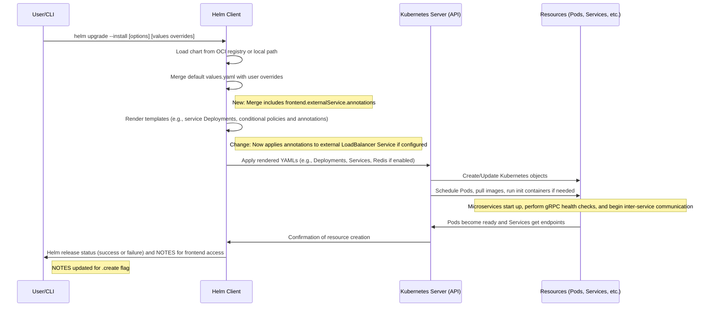
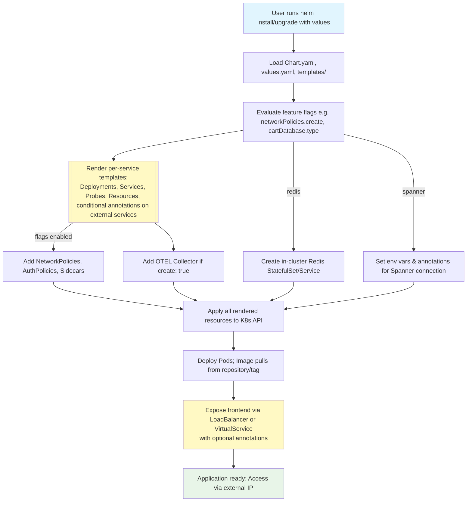

# PR #2636: Workflow Design Impact Analysis

## Affected Workflows
- **Workflow 3: Helm Chart Deployment**: The PR directly modifies files in the `helm-chart/` directory, including `values.yaml` and `templates/frontend.yaml`, introducing new configuration options for the frontend external service annotations. This aligns with the workflow's relevant files (`helm-chart/`, `helm-chart/values.yaml`) and impacts the templating and customization mechanisms.

- **Workflow 7: Release Process**: Changes to the Helm chart are incorporated into the release artifacts via `docs/releasing/make-helm-chart.sh`, which packages and pushes the chart to Artifact Registry. Thus, new releases will include the enhanced external service configuration.

## Workflow 3 Analysis
### Summary of design changes
The PR adds support for custom annotations on the frontend-external LoadBalancer Service by restructuring `frontend.externalService` into an object with `create: true` (default) and `annotations: {}` fields in `values.yaml`. Template logic in `frontend.yaml` now conditionally applies these annotations and uses `.create` for service creation. Related updates in `README.md`, `NOTES.txt`, and CI workflows ensure consistency with the new structure. This enhances the workflow's flexibility for external integrations like external-dns, which can use annotations to automate DNS records for the service IP.

**Affected aspects**: Values schema, template rendering for services, conditional resource creation, and documentation examples. The core deployment sequence remains intact, but rendering now includes annotation application as a new step/capability.

**Implementation**: New values path and YAML templating with `{{- with .Values.frontend.externalService.annotations }}` block in service metadata.

**Benefits/Implications**: Enables seamless DNS management in GKE/other clouds, reducing manual configuration for production deploys. Potential for broader annotation support in future services.

The design document (`.exp/design-workflow-3-helm-chart-deployment.md`) has been updated to document the new feature in values description, deployed resources, customization examples, and diagram notes. No major structural changes to sequences or flows; minor textual updates to reflect added capability.

### Pre-PR vs Post-PR Deployment Flow (Sequence Diagram Diff)
The following updated sequence diagram highlights changes in green (additions) and yellow (modifications):

- **Green additions**: Notes on new merge and render steps for annotations.
- **Yellow changes**: Updated render message and NOTES reference.
- **No removals**.

### Pre-PR vs Post-PR Component Creation (Flowchart Diff)
Updated flowchart with changes highlighted:

- **Yellow (change fill)**: RenderServices and Expose nodes updated to mention annotations support.
- **Green (addition)**: No new nodes; integrated into existing.
- **No red removals**.

## Workflow 7 Analysis
### Summary of design changes
No structural changes to the release process scripts or logic. However, the PR's updates to `helm-chart/` are automatically included when running `make-helm-chart.sh`, which updates Chart.yaml, packages the chart, and pushes to OCI registry. Future releases will propagate the new annotations feature to users deploying from official charts.

**Implications**: Enhances released Helm chart functionality without altering the release workflow itself. Benefits users of released artifacts with improved external service configuration options.

No design documentation found for Workflow 7, so no diagrams or further updates performed. If a design doc exists or is added, it should note the inclusion of Helm chart enhancements in artifacts.

