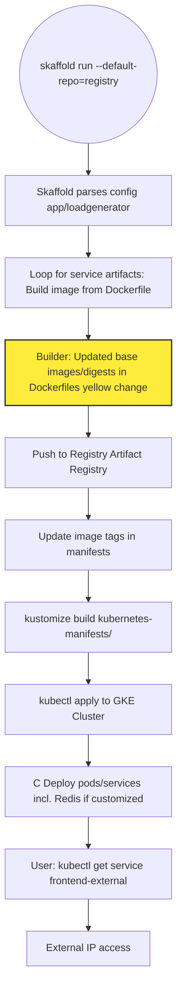
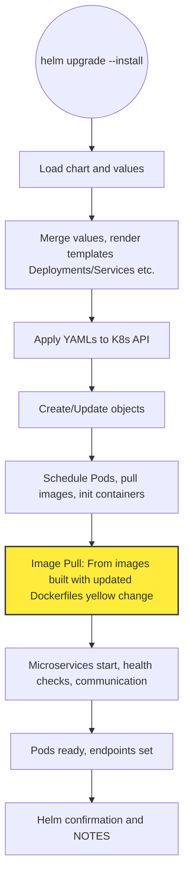

# PR #2799: Workflow Design Impact Analysis

## Affected Workflows
- **Local Development Workflow**: The PR updates Dockerfiles for multiple services (cartservice, currencyservice, emailservice, loadgenerator, paymentservice, recommendationservice, shoppingassistantservice), which are explicitly listed in the workflow's relevant_files as "src/*/Dockerfile". These changes affect the Skaffold build artifacts used in local image building and hot reloading.
- **GKE Deployment Workflow**: Updates to Dockerfiles impact the Skaffold build and push steps during `skaffold run`, as documented in the workflow's relevant_files including skaffold.yaml and src/*/Dockerfile implicitly through build process.
- **Helm Chart Deployment**: Indirect impact; the design doc notes reliance on src/*/Dockerfile for building images that Helm deploys via templates referencing those images.
- **Cloud Build CI/CD Pipeline**: cloudbuild.yaml invokes skaffold run, which builds from the updated Dockerfiles.
- **Release Process**: The make-docker-images.sh script performs gcloud builds submit in each src/ directory, directly using the updated Dockerfiles to build and push tagged images.
- **Adding New Microservice**: Changes to existing Dockerfiles update the dependency versions that serve as examples and templates in the adding-new-microservice.md guide and integrations with skaffold/helm/kustomize.

## Local Development Workflow Analysis
### Summary of design changes
This PR performs routine dependency updates to Docker base images across several microservices' Dockerfiles. Specific changes include:
- **cartservice/src/Dockerfile.debug**: Updated .NET aspnet and sdk image digests.
- **currencyservice/Dockerfile**: Updated Node.js alpine builder image digest.
- **emailservice/Dockerfile**: Updated Python from 3.12.8-slim to 3.14.0-slim.
- **loadgenerator/Dockerfile**: Updated Python alpine image.
- **paymentservice/Dockerfile**: Updated Node.js image digest.
- **recommendationservice/Dockerfile**: Updated Python slim image.
- **shoppingassistantservice/Dockerfile**: Updated Python alpine image.

These updates modify the "Dockerfiles" component. The workflow sequence remains unchanged; builds now use newer bases for potential security/performance benefits. No new/removed steps. Implications: Test for compatibility.

The Initial Deployment diagram updated to highlight change (yellow node for updated build step):

```mermaid
flowchart TD
    Start((skaffold dev)) --> Load[Skaffold loads skaffold.yaml artifacts and manifests]
    Load --> Build[Loop: docker build from src/<service>/Dockerfile for each artifact]
    Build --> Updated[Docker Build: Uses updated base images in Dockerfiles yellow change]
    Updated --> Kustomize[kustomize build kubernetes-manifests/ | kubectl apply]
    Kustomize --> Pods[K8s creates Deployments, Services, Pods pulling local images]
    Pods --> PF[kubectl port-forward frontend 8080:8080]
    PF --> Access[Access app at localhost:8080]
    style Updated fill:#ffeb3b,stroke:#333,stroke-width:2px
```

Similar for Hot Reload.

No updates to design doc needed.

## GKE Deployment Workflow Analysis
### Summary of design changes
Similar updates affect Skaffold's build/push in GKE workflow. Newer images pushed to registry. Benefits for cloud deploys.

Updated Direct Deployment diagram (highlighted changed build step with yellow):



No doc updates.

## Helm Chart Deployment Analysis
### Summary of design changes
Indirect: Updated Dockerfiles affect images pulled during pod scheduling in Helm deployments. No change to Helm logic.

Updated Deployment Flow diagram (highlighted changed image pull with yellow):



No doc updates.

## Cloud Build CI/CD Pipeline Analysis
### Summary of design changes
The pipeline uses cloudbuild.yaml to run skaffold run, so Dockerfile updates affect remote builds in Cloud Build. Similar benefits. No design doc to update diagram.

## Release Process Analysis
### Summary of design changes
make-docker-images.sh and related scripts build images per service using Dockerfiles; updates ensure release images use latest bases. No diagram.

## Adding New Microservice Analysis
### Summary of design changes
When adding new service, developers reference existing Dockerfiles as templates; updates modernize these examples. Affects integration with build tools.

