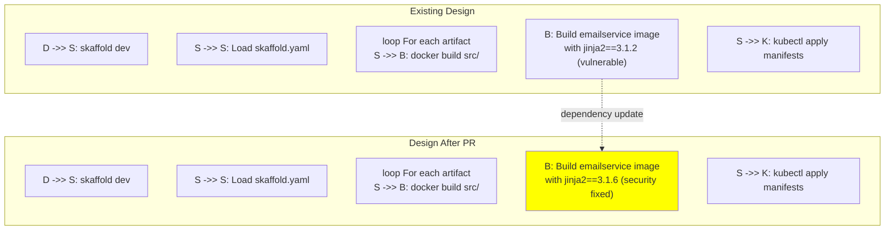
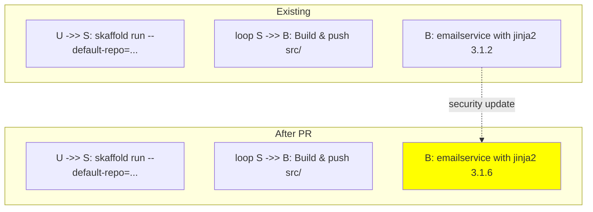
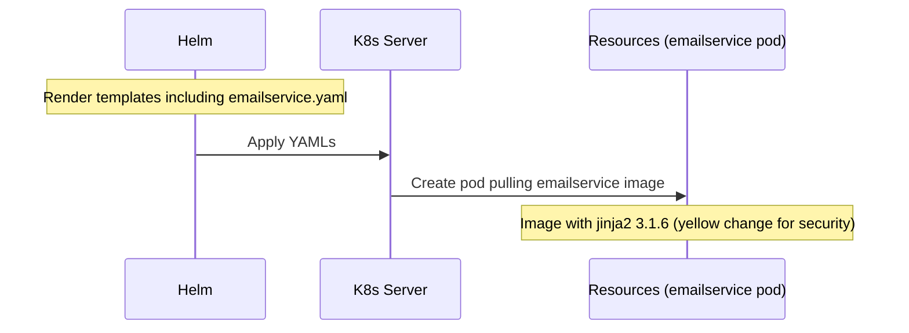

# PR #3001: Workflow Design Impact Analysis

## Affected Workflows
- **Local Development Workflow** (defined in .exp/workflows.json): Impacted because the PR changes a dependency file in `src/emailservice/requirements.in`, which is used during the Docker image build for emailservice in Skaffold's development loop. Evidence: `skaffold.yaml` defines an artifact for emailservice with context `src/emailservice`; design doc `.exp/design-workflow-1-local-development-workflow.md` describes building images from `src/<service>/Dockerfile` in sequence diagrams.

- **GKE Deployment Workflow**: Impacted similarly, as Skaffold builds and pushes the emailservice image to a registry during deployment to GKE. Evidence: Same `skaffold.yaml`; design doc `.exp/design-workflow-2-gke-deployment-workflow.md` shows build-push loops for service artifacts.

- **Helm Chart Deployment**: Impacted because the Helm chart templates include `emailservice.yaml`, deploying the emailservice pod which pulls the Docker image containing the updated dependency. Evidence: `helm-chart/templates/emailservice.yaml` exists; design doc `.exp/design-workflow-3-helm-chart-deployment.md` describes rendering templates and deploying pods that pull images.

- **Kustomize Customization and Deployment**: Impacted as the base manifests include `emailservice.yaml`, and applied resources reference the emailservice image with updated deps. Evidence: `kustomize/base/emailservice.yaml`; design doc `.exp/design-workflow-4-kustomize-customization-and-deployment.md` details base resources and component patches applied before deployment.

- **Cloud Build CI/CD Pipeline** (workflow 6): Impacted via use of `cloudbuild.yaml` and `skaffold.yaml` to build images, including emailservice, in automated pipelines. Evidence: Relevant files include `skaffold.yaml` which builds emailservice.

- **Release Process** (workflow 7): Impacted as release scripts in `docs/releasing/` build and tag Docker images from `src/`, including emailservice with the new dependency version. Evidence: Relevant files `docs/releasing/*.sh`; standard release flow builds all service images for tagged releases.

No new workflows are added by this PR.

## Workflow 1 Analysis (Local Development Workflow)
### Summary of design changes
The PR updates Jinja2 from 3.1.2 to 3.1.6 in `src/emailservice/requirements.in` to address security vulnerabilities (e.g., XSS via xmlattr filter, arbitrary code execution in sandbox). This affects the emailservice Docker image build step in Skaffold's loops for initial deployment and hot reload cycles. The change is implemented by Renovate bot updating the pinned version in requirements.in, which propagates to requirements.txt and pip install in Dockerfile. Benefits: Enhanced security for emailservice's template rendering (used in email_server.py for confirmation.html), reducing potential attack surface without breaking changes. No new steps, removed components, or altered interactions in the workflow design.

Mermaid diagrams that need updating: Initial Deployment and Hot Reload Cycle sequences, specifically the Docker Build interaction for emailservice.

#### Diff for Initial Deployment Sequence


Similar diff applies to Hot Reload Cycle diagram's rebuild step.

## Workflow 2 Analysis (GKE Deployment Workflow)
### Summary of design changes
Analogous to Workflow 1, the PR impacts the build step in both direct local Skaffold deployment and Cloud Build variant sequences. The emailservice image pushed to registry now includes the secure Jinja2 version. Implemented via requirements.in update, affecting Dockerfile's pip install. Implications: Secure images deployed to GKE, mitigating CVEs in production-like environments. No structural changes to workflow.

Mermaid diagrams: Direct Deployment and Cloud Build Variant.

#### Diff for Direct Deployment Sequence


## Workflow 3 Analysis (Helm Chart Deployment)
### Summary of design changes
The PR affects the image pulled by the emailservice Deployment pod rendered from `templates/emailservice.yaml`. During deployment flow, pods now run with secure Jinja2. The change is in source deps, not Helm templates or values. Benefits: Secure deployment of emailservice via Helm without workflow modifications. No changes to rendering, conditional logic, or resource creation.

Mermaid diagrams: Deployment Flow sequence and Component Creation flowchart.

No structural updates needed; the "Deploy Pods; Image pulls" step implicitly benefits from updated images.

#### Illustrative Diff for Deployment Flow


(Note: Mermaid sequence with rect for change.)

## Workflow 4 Analysis (Kustomize Customization and Deployment)
### Summary of design changes
Base `emailservice.yaml` is included in composition, deployed with possible component patches. PR updates image content for emailservice, affecting runtime security post-apply. No impact on Kustomize processing, patches, or resource additions. Benefit: Customized deployments include secure emailservice.

Mermaid diagrams: User Interaction sequence and Manifest Composition flowchart.

No updates needed; change is external to manifests (in image build).

#### Illustrative Diff for Manifest Composition
```mermaid
flowchart TD
    Base["Base: includes emailservice.yaml"]
    Comp["Components patches"]
    Final["Final: deploys emailservice image"]
    Base --> Comp --> Final
    style Final fill:#ffff00
    Note: Image now with updated jinja2 for security
```

## Workflows 6 and 7 Analysis
For Cloud Build CI/CD and Release Process, no design documents available yet (files not present). However, both involve building emailservice images similarly to workflows 1 and 2, so the PR improves security in produced artifacts without altering pipeline or script steps.

## Updates to Design Documents
No updates to existing .exp/design-workflow-*.md files are required, as the PR does not change the documented high-level designs, sequences, or components. The dependency update is an implementation detail within service builds, not reflected in current diagrams. Future docs could note security practices for deps if relevant.

The PR can be merged safely without workflow disruptions.