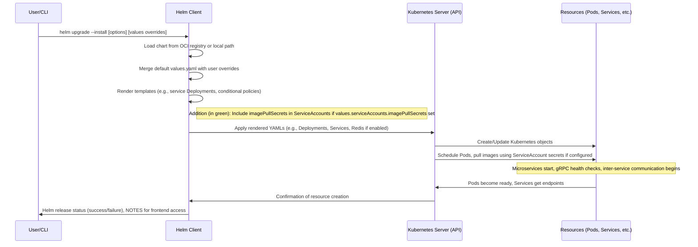
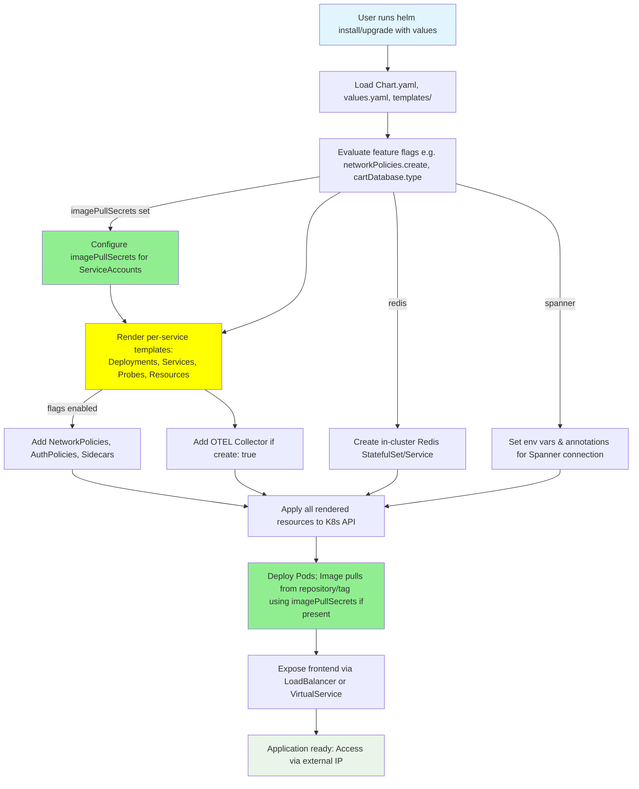

# PR #3059: Workflow Design Impact Analysis

## Affected Workflows
- **Helm Chart Deployment (Workflow 3)**: This workflow is directly impacted as the PR changes multiple template files in `helm-chart/templates/` to include optional `imagePullSecrets` in ServiceAccount resources. This enhances the configurability of deployments for private image registries. Justification: All changed files are Helm templates used in this workflow's rendering process during `helm install/upgrade`.

No other workflows are affected, as they rely on Kubernetes manifests or other tools without these Helm-specific changes. Workflows like Release Process (7) will indirectly include this in future chart publications, but no design changes to their flows.

## Workflow 3 Analysis

### Summary of design changes
The PR adds a new configuration capability to the Helm chart by templating `imagePullSecrets` into ServiceAccounts for each microservice and the OpenTelemetry collector. This is achieved through conditional Go templating in each service template file, referencing a new values path `serviceAccounts.imagePullSecrets`.

- **Affected aspects**: Template rendering step now supports additional ServiceAccount metadata; deployed resources include pull secrets if configured; customization examples now cover private registry setups.
- **Implementation**: Added 4 lines of Helm templating in 12 files, allowing list override in values for all service accounts uniformly.
- **Benefits**: Enables secure image pulls from private repositories (e.g., via dockerconfigjson secrets), useful for restricted environments; no impact on public image deployments.
- **Implications**: Users must manage secrets separately; enhances flexibility but adds a dependency on secret existence for private images.

The design documentation has been updated to reflect these changes, including descriptions, examples, and diagram annotations.

### Diff: Deployment Flow Sequence Diagram
This updated sequence diagram highlights the addition in green (rendering of ServiceAccounts with imagePullSecrets).

(Note: The green highlighting via note and style on H for render phase.)

### Diff: Component Creation Flowchart
Updated flowchart with green for added/changed elements related to imagePullSecrets.

- **Green rectangles**: New additions like ConfigIPS node and enhanced Deploy step for image pulls.
- **Yellow rectangle**: Changed RenderServices to note the inclusion.
- No red (removals).

These diagrams illustrate the integration of the new feature into the existing design.
