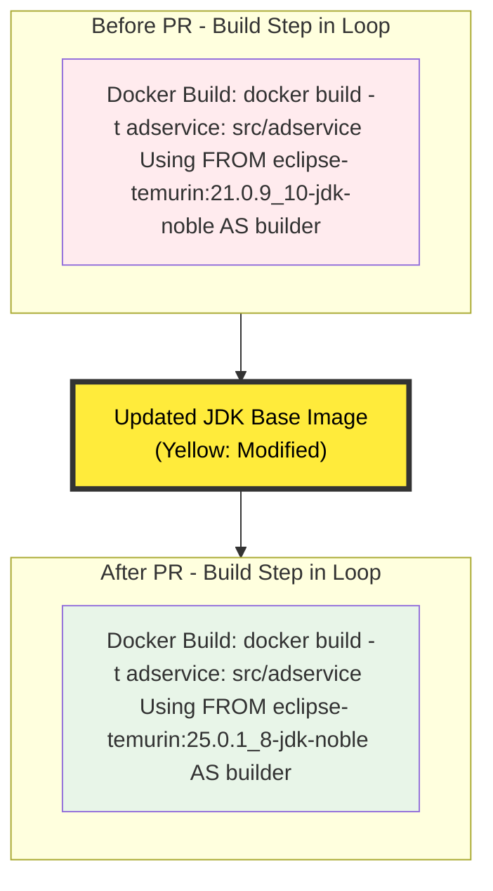
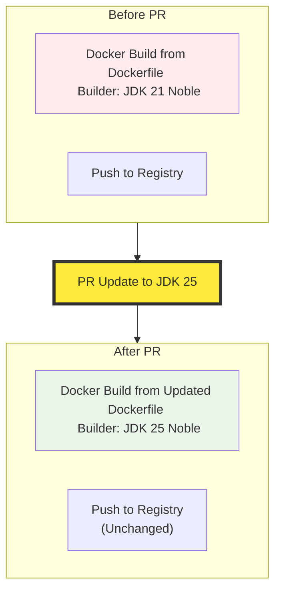

# PR #3150: Workflow Design Impact Analysis

## Affected Workflows
- **Local Development Workflow** (Workflow 1): The PR modifies `src/adservice/Dockerfile`, explicitly listed in the workflow's `relevant_files` as `"src/*/Dockerfile"`. This workflow uses Skaffold (`skaffold dev`) to locally build Docker images from these files, enabling hot reloading during development.
- **GKE Deployment Workflow** (Workflow 2): The design documentation explicitly references `src/*/Dockerfile` as the build contexts for Skaffold artifacts. The workflow (`skaffold run --default-repo=<registry>`) builds and pushes images using these Dockerfiles before deploying to GKE. Evidence from `skaffold.yaml` confirms an artifact for `adservice` with context `src/adservice`.
- **Helm Chart Deployment** (Workflow 3): The design document states it "builds on `kubernetes-manifests/` and `src/*/Dockerfile` for images," indicating reliance on images built from these Dockerfiles. Though the workflow itself is deployment-only via Helm, the PR impacts the prerequisite image build for adservice.
- **Cloud Build CI/CD Pipeline** (Workflow 6): Relevant files include `cloudbuild.yaml` and `skaffold.yaml`. `cloudbuild.yaml` runs `skaffold run`, which builds images from Dockerfiles including adservice's. The PR affects the CI/CD build process.
- **Release Process** (Workflow 7): Scripts like `docs/releasing/make-docker-images.sh` iterate over `src/` directories, cd to `src/adservice`, and run `gcloud builds submit --tag=...`, building the updated Dockerfile and pushing official tagged images.

No evidence of impact on Workflows 4, 5, or 8, as they do not involve building from source Dockerfiles (focus on customization, infra provisioning, and adding new services without modifying existing Dockerfiles).

## Workflow 1 Analysis (Local Development Workflow)
### Summary of design changes
The PR specifically affects the **Docker Build** component described in the design documentation under "Components" (Dockerfiles in `src/<service>/Dockerfile`) and the sequence diagrams. It updates the builder stage base image from `eclipse-temurin:21.0.9_10-jdk-noble` to `eclipse-temurin:25.0.1_8-jdk-noble`, a major version upgrade from JDK 21 to JDK 25. This modifies the Java compilation and dependency resolution environment for the adservice (a Java/Gradle service).

- **Affected aspects**: Build process details for adservice artifact in the initial deployment loop and hot reload cycle. No new steps added, no components removed, but the build interaction now uses an updated toolchain.
- **Implementation**: Direct string replacement in Dockerfile's FROM directive, including updated SHA digest for reproducibility.
- **Benefits/Implications**: Leverages latest JDK security patches, bug fixes, and features (e.g., improved pattern matching, virtual threads enhancements). Potential implications include compatibility issues if adservice code relies on JDK 21-specific behaviors, though Renovate's update suggests testing passed. Workflow remains fully functional; rebuilds will produce images with newer base.

The **Initial Deployment** and **Hot Reload Cycle** sequence diagrams need updates to reflect the changed build environment for adservice. Below is a diff visualization for the build step:

*(Red for deprecated old config, yellow for change, green for new config. This can be integrated as a note or modified message in the original sequences.)*

## Workflow 2 Analysis (GKE Deployment Workflow)
### Summary of design changes
Similar to Workflow 1, the PR impacts the **Docker Build** component in both the "Direct Deployment Sequence" and "Cloud Build CI/CD Variant Sequence" diagrams. The design doc lists `src/*/Dockerfile` under relevant codebase elements and components. The update changes the builder image for adservice, affecting image builds (local or via GCB profile) and subsequent pushes to Artifact Registry.

- **Affected aspects**: Build loop for service artifacts, where adservice's Gradle build (`./gradlew installDist`) now compiles with JDK 25.
- **Implementation**: Same Dockerfile update, influencing pushed images deployed to GKE.
- **Benefits/Implications**: Ensures release and deployed images use modern Java runtime deps; may improve build times or security scanning in GKE. No sequence changes, but updated images could affect runtime if builder changes propagate (e.g., via copied artifacts). Compatible with multi-platform builds in skaffold.yaml.

Affected diagrams: Both sequences. Diff visualization (analogous to Workflow 1, with additional push step unchanged):

*(Highlights modification in build before push/deploy to GKE.)*

## Workflow 3 Analysis (Helm Chart Deployment)
### Summary of design changes
The workflow's core is Helm templating and `kubectl apply` of rendered manifests (Deployments, Services, etc.), with no explicit build step in sequences. However, under "Integration with Codebase," it depends on `src/*/Dockerfile` for building images referenced in chart templates (via `values.yaml` image configs). The PR updates adservice's builder image, affecting the content of the `adService` image pulled during pod scheduling.

- **Affected aspects**: Prerequisite image build (outside workflow scope), potentially impacting deployed pod behavior if build changes affect binary size/runtime deps.
- **Implementation**: Indirect; Helm users must rebuild/push images separately before `helm upgrade`.
- **Benefits/Implications**: Updated images bring JDK upgrades to deployed service; no change to Helm flow, diagrams, or components. Diagrams (Deployment Flow, Component Creation Flowchart) unchanged.

No mermaid diagrams need updates, as no build represented.

## Workflow 6 Analysis (Cloud Build CI/CD Pipeline)
### Summary of design changes
This workflow triggers `gcloud builds submit --config=cloudbuild.yaml`, which executes Skaffold to build images (including from `src/adservice/Dockerfile`) and deploy to GKE. The PR modifies the Dockerfile used in this automated pipeline's build phase.

- **Affected aspects**: Remote build step within Cloud Build workers.
- **Implementation**: Cloud Build will use the updated Dockerfile on next run, producing images with JDK 25-built artifacts.
- **Benefits/Implications**: Automates inclusion of dep updates in CI/CD; ensures consistent modern builds. No documented design file found, so no specific diagrams to update. Impacts similar to Workflow 2's variant.

No mermaid diagram provided.

## Workflow 7 Analysis (Release Process)
### Summary of design changes
The release workflow runs `./docs/releasing/make-release.sh`, which calls `make-docker-images.sh` to build and push tagged images for each service. For adservice, it cds to `src/adservice` and runs `gcloud builds submit --tag=<image>`, using the local Dockerfile (no explicit cloudbuild.yaml per service; defaults to Dockerfile build).

- **Affected aspects**: Image build step for official releases.
- **Implementation**: Next release will build adservice with JDK 25 base, updating SHA-pinned image layers.
- **Benefits/Implications**: Keeps released images up-to-date with latest base deps; may require verification of Java compatibility in release testing. No documented design file or diagrams found.

No mermaid diagram provided.

**Overall**: The PR is a routine dependency update with minimal impact on workflow designs—primarily enhancing the build components across image-building workflows. No updates to `.exp` design documents are required, as they describe high-level flows without specifying internal Dockerfile details. All changes maintain backward compatibility for the workflows.