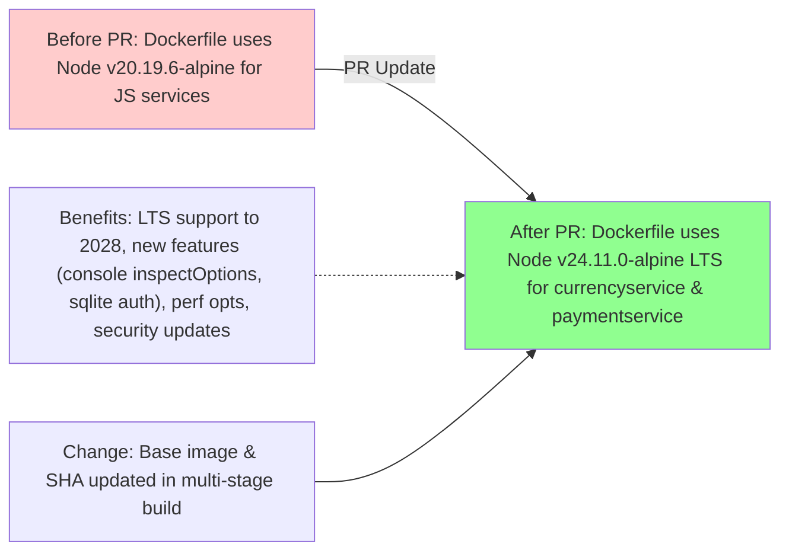
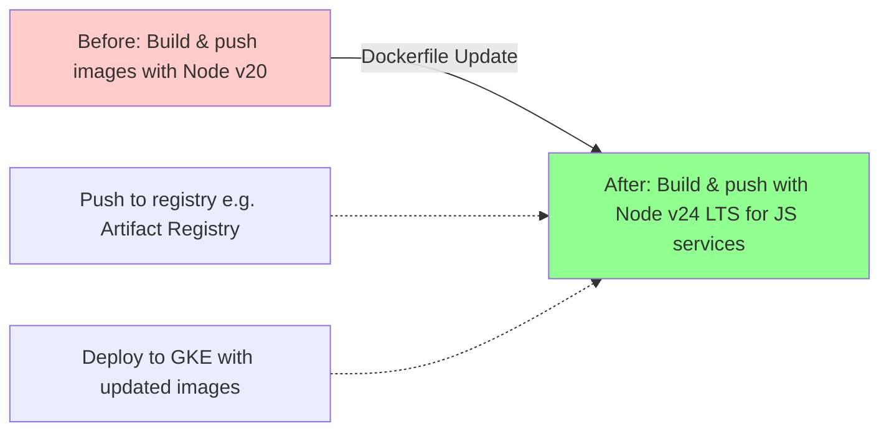
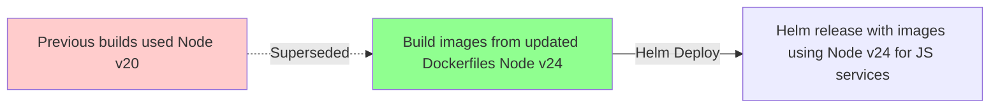

# PR #3151: Workflow Design Impact Analysis

## Affected Workflows
- **Local Development Workflow**: The PR directly impacts this workflow as it updates Dockerfiles listed in its relevant_files (src/*/Dockerfile). Specifically, the image build steps for currencyservice and paymentservice now use Node.js v24.11.0-alpine instead of v20.19.6-alpine.
- **GKE Deployment Workflow**: Affected via Skaffold's build artifacts that reference the updated Dockerfiles in src/currencyservice and src/paymentservice. The build and push steps incorporate the new Node.js version.
- **Helm Chart Deployment**: The design document mentions reliance on src/*/Dockerfile for images; updating these affects the images deployed via Helm.
- **Cloud Build CI/CD Pipeline**: Cloudbuild.yaml invokes Skaffold, which builds images from the updated Dockerfiles.
- **Release Process**: The make-docker-images.sh script builds Docker images for all microservices, including the updated ones for currencyservice and paymentservice.

## Local Development Workflow Analysis
### Summary of design changes
This PR upgrades the Node.js runtime in the Dockerfiles for currencyservice and paymentservice to version 24.11.0-alpine, which has entered LTS status ('Krypton') with support until April 2028. This change affects the Docker build step in the workflow's sequence diagrams, enabling access to new semver-minor features like per-stream inspectOptions in console, removal of deprecated util.getCallSite, new sqlite authorization API, and various performance improvements (e.g., optimized priority queue, better array inspection). No structural changes to the workflow steps or components; it's an internal upgrade to the build process for JS services. Potential benefits include enhanced debugging, security updates (e.g., OpenSSL 3.5.4), and compatibility with modern Node features. Implications: Services may leverage new APIs, but code should be tested for any deprecations. The design documents have been updated to reflect the new version.

This flowchart highlights the change (green for new/updated) in the build component, with no removals (no red).

## GKE Deployment Workflow Analysis
### Summary of design changes
Similar to local development, the PR updates the Node.js version in relevant Dockerfiles, impacting the Skaffold build-push step for the affected services during GKE deployment. This introduces the v24 LTS runtime to deployed images, providing the same benefits of new features, performance enhancements, and long-term support. The workflow design remains unchanged structurally, but the built images now run on updated Node.js, potentially affecting runtime behavior if services use new APIs. Design docs updated accordingly.

Yellow not used as no partial change shown; green for updated build.

## Helm Chart Deployment Analysis
### Summary of design changes
The Helm workflow relies on pre-built images from src/*/Dockerfile. The PR's update means future image builds for Helm deployments will use Node v24 for the JS services, bringing LTS stability and new capabilities. No direct change to Helm templates or values, but affects the overall application runtime. Doc text updated to note the version.

Shows addition of updated build leading to new release.

## Cloud Build CI/CD Pipeline Analysis
### Summary of design changes
Cloud Build triggers Skaffold via cloudbuild.yaml, which builds images from the updated Dockerfiles. The pipeline now produces images with Node v24 for affected services, enabling automated deployments with latest runtime. No changes to pipeline steps or cloudbuild config; impact is in the delegated build process. (Note: Design doc missing; analysis based on workflows.json and code inspection.)

No mermaid diagram available in doc to update; conceptual change in build stage.

## Release Process Analysis
### Summary of design changes
The release script make-docker-images.sh builds and tags images for release, using the updated Dockerfiles. Thus, released images for currencyservice and paymentservice will use Node v24 LTS, ensuring releases benefit from updates. Affects image artifacts and subsequent manifest updates. (Note: Design doc missing.)

No mermaid; change in docker build commands within scripts.