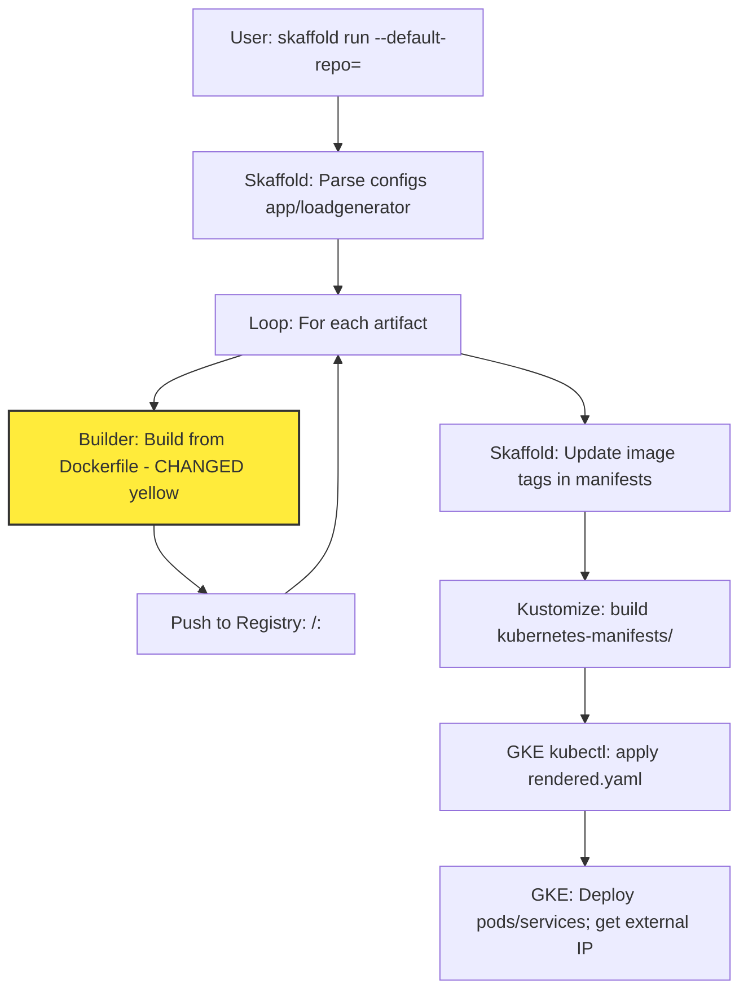

# PR #3155: Workflow Design Impact Analysis

[PR #3155](https://github.com/GoogleCloudPlatform/microservices-demo/pull/3155)

## Affected Workflows
- **Local Development Workflow**: Updates to Dockerfiles and dependency lock files (e.g., go.mod, package.json, requirements.txt indirectly via refreshed outputs) in multiple services affect the local image build process during `skaffold dev`. Evidence: skaffold.yaml defines artifacts with contexts in changed src/ directories; Dockerfiles explicitly updated (e.g., base image digests, ENV adjustments in emailservice/recommendationservice).
- **GKE Deployment Workflow**: Similar impacts on `skaffold run` builds and pushes to registry, including via Cloud Build profile in cloudbuild.yaml.
- **Cloud Build CI/CD Pipeline**: cloudbuild.yaml triggers skaffold run in Cloud Build environment, using updated Dockerfiles for image builds.
- **Release Process**: make-docker-images.sh performs `docker build` in each service directory, directly impacted by Dockerfile changes and updated deps.

No other workflows are affected, as they do not involve building images from source (e.g., Helm/Kustomize assume pre-built images; Terraform provisions infra only).

## Local Development Workflow Analysis
### Summary of design changes
The PR, generated by Renovate for lock file maintenance, updates dependency versions across services and modifies Dockerfiles (e.g., updating Python base image from 3.12.12-alpine to 3.12.8-alpine in emailservice and recommendationservice, removing redundant ENV settings, similar updates in Go/Node/Java services). These changes affect the internal details of the Docker image build step but do not introduce new steps, modify sequences, or remove components in the workflow design. The implementation now uses updated base images and deps, which may improve security, fix bugs, or optimize builds. Potential implications include altered runtime behavior if deps introduce breaking changes (though Renovate aims for compatible updates) and changes in image sizes/scan results.

The Mermaid diagrams in [.exp/design-workflow-1-local-development-workflow.md](.exp/design-workflow-1-local-development-workflow.md) do not require updates to the original files, as high-level flows remain identical. However, to illustrate the impact, below is a diff representation using a flowchart highlighting the changed build step in yellow:

```mermaid
graph TD
    A[Developer: skaffold dev] --> B[Skaffold: Load skaffold.yaml artifacts & manifests]
    B --> C[Loop: For each service artifact]
    C --> D[Docker Build: docker build src/<service>/Dockerfile - UPDATED yellow: new base images, ENV, deps]
    D --> C
    C --> E[Skaffold: Deploy via kustomize build | kubectl apply]
    E --> F[K8s Cluster: Create/rollout pods & services]
    F --> G[Developer: kubectl port-forward & access localhost:8080]
    classDef changed fill:#ffeb3b,stroke:#333,stroke-width:2px,color:#000
    class D changed
```

Similar impact applies to the hot reload cycle diagram, where rebuilds of affected images use updated Dockerfiles.

## GKE Deployment Workflow Analysis
### Summary of design changes
Analogous to Local Development, the PR impacts image builds during `skaffold run --default-repo=<registry>`, affecting both local Docker builds and remote Cloud Build executions. Changes to Dockerfiles and lock files (e.g., go.sum updates, package-lock.json) are implemented by Renovate to refresh to latest versions. This modifies the build and push sub-steps but preserves the overall design of building, tagging, pushing to registry, rendering manifests, and deploying to GKE. Benefits: Ensures deployed images use current deps for better maintainability and security. Implications: May require re-testing deployments for any subtle dep-related issues.

Diff representation for Direct Deployment sequence (original is sequenceDiagram; simplified to flowchart for diff visualization):



The Cloud Build variant diagram is similarly affected in its build workers step. No updates to original design doc needed.

## Cloud Build CI/CD Pipeline Analysis
### Summary of design changes
This workflow automates builds via `gcloud builds submit --config=cloudbuild.yaml`, which internally runs `skaffold run`. Thus, it inherits the build impacts from updated Dockerfiles and deps in services. No documented Mermaid diagrams available (file .exp/design-workflow-6.md not present), so no diff visualization. The PR implements changes via refreshed lock files and Dockerfile tweaks, ensuring CI/CD produces images with latest deps without altering the pipeline structure. Benefits: Automated updates keep CI images current. No design doc to update.

## Release Process Analysis
### Summary of design changes
The release workflow uses `./docs/releasing/make-release.sh`, which calls `make-docker-images.sh` to build and push tagged images for all services using `docker build` in src/<service> contexts. Updated Dockerfiles directly affect these builds. Additionally, updated manifests in release/*.yaml may be generated post-build. No design doc available. Changes do not affect the script logic or high-level release steps (build, tag, push, update manifests/PR). Benefits: Release artifacts include latest deps/base images. No doc to update.