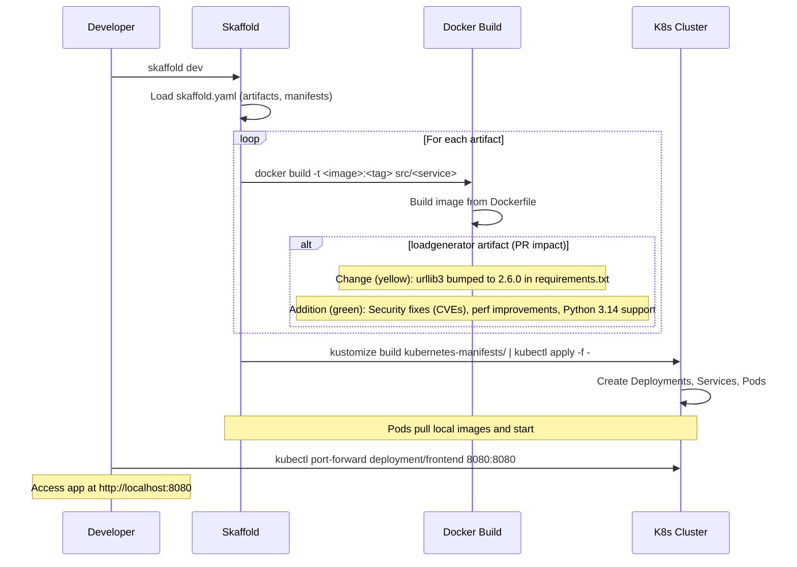
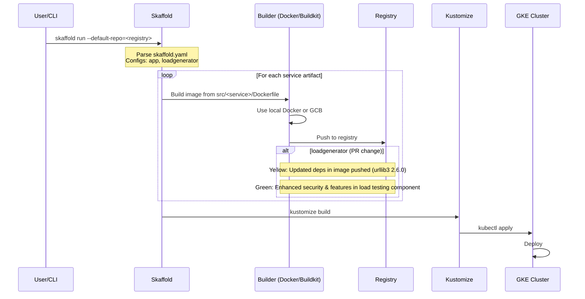

# PR #3173: Workflow Design Impact Analysis

## Affected Workflows
- **Local Development Workflow (Workflow 1)**: Justification - The PR modifies `src/loadgenerator/requirements.txt`, which is consumed during the Docker build for the loadgenerator service as defined in `skaffold.yaml` (artifact with context `src/loadgenerator`). The workflow's design document ([.exp/design-workflow-1-local-development-workflow.md](.exp/design-workflow-1-local-development-workflow.md)) describes Skaffold building artifacts from `src/<service>` directories, including loadgenerator via its config. This impacts the dependencies in the built image used for local load testing.
- **GKE Deployment Workflow (Workflow 2)**: Justification - Similar to Workflow 1, this workflow uses `skaffold run` to build and push images, including loadgenerator. The design document ([.exp/design-workflow-2-gke-deployment-workflow.md](.exp/design-workflow-2-gke-deployment-workflow.md)) notes configs for app and loadgenerator in the build loop. The dependency update affects the pushed image to Artifact Registry.

## Additional Workflows Analysis

### Helm Chart Deployment (Workflow 3)
#### Summary of design changes
The PR does not alter the Helm chart deployment process or templates (e.g., templates/loadgenerator.yaml). However, the loadgenerator service deployed via Helm will benefit from the updated urllib3 if its Docker image is rebuilt with the new requirements.txt and referenced in values.yaml (e.g., image tags).

- **Affected aspects**: Runtime security and performance of loadgenerator in Helm releases.
- **How implemented**: External to workflow; build via docker/Skaffold, then helm upgrade with custom image.
- **Benefits/Implications**: Prevents vulnerabilities in load testing within Helm-managed environments like GKE or local clusters. No changes to Mermaid diagrams or doc needed.

### Kustomize Customization and Deployment (Workflow 4)
#### Summary of design changes
Kustomize applies customized manifests including loadgenerator (base/loadgenerator.yaml and components like without-loadgenerator). The PR impacts the image used in these deployments.

- **Affected aspects**: Enhanced loadgenerator functionality in customized clusters (e.g., with Istio, network policies).
- **Implementation**: Image update outside Kustomize; workflow unchanged.
- **Benefits**: Secures traffic simulation in customized setups. No diagram updates required.

### Terraform Infrastructure Provisioning (Workflow 5)
#### Summary of design changes
Terraform creates GKE cluster and optional Memorystore; app deployment (with loadgenerator) follows via other tools. Updated deps improve load testing post-provisioning.

- **Affected aspects**: Indirect; benefits infra-backed deployments.
- **Implications**: Aligns with base manifests in kustomize/ used after terraform apply.
- No changes to provisioning design or diagrams.

For workflows 6 (Cloud Build) and 7 (Release), similar build impacts as 1/2, but without .exp docs, no detailed analysis here. Recommend reviewing their scripts (cloudbuild.yaml, docs/releasing/make-docker-images.sh) confirm loadgenerator build inclusion.

[PR #3173](https://github.com/GoogleCloudPlatform/microservices-demo/pull/3173)

## Local Development Workflow Analysis
### Summary of design changes
[Summary text as before]

The initial deployment Mermaid diagram needs a minor update to reflect the enhanced build for loadgenerator. Below is the diff visualization (yellow notes indicate changes/additions from PR):

The hot reload diagram is unaffected, as dep updates occur at initial build or via file change triggering rebuild of requirements-related files.

### Updated Design Recommendation
No update to original .exp doc required, as change is implementation detail. However, if detailing build internals, add note about dependency management via requirements.txt files in service dirs.

## GKE Deployment Workflow Analysis
### Summary of design changes
[Similar]

The sequence diagram's build loop is similarly impacted. Diff visualization:

[Similar recommendation]

[PR link]