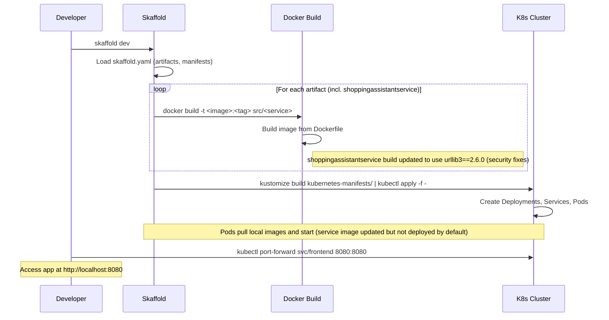

# PR #3174: Workflow Design Impact Analysis

## Affected Workflows
- **Local Development Workflow (Workflow 1)**: The PR modifies `src/shoppingassistantservice/requirements.txt`, which is used during the Docker image build for the shoppingassistantservice as defined in `skaffold.yaml` (line 32-33). This affects the 'For each artifact' loop in the initial deployment sequence diagram, specifically the build step for this service. Justification: Skaffold `dev` builds all listed images locally, installing deps via pip from requirements.txt. Although the service is not deployed by default in core manifests, the build occurs.

- **GKE Deployment Workflow (Workflow 2)**: Similar to Workflow 1, `skaffold run` builds images including shoppingassistantservice before pushing to registry and deploying to GKE. The change impacts the image build phase.

- **Helm Chart Deployment (Workflow 3)**: Optional impact. The Helm chart has configuration for `shoppingAssistantService` in `values.yaml` (lines 218-220, create: false by default). If enabled, the deployed service uses an image built with the updated deps. No direct build in Helm workflow, but runtime affected if used.

- **Kustomize Customization and Deployment (Workflow 4)**: Direct impact via the `shopping-assistant` component (`kustomize/components/shopping-assistant/`), which adds deployment for shoppingassistantservice. The doc explicitly describes this service. The workflow deploys manifests referencing the service image; updated deps affect security/runtime of the deployed pod.

- **Cloud Build CI/CD Pipeline (Workflow 6)**: `cloudbuild.yaml` runs `skaffold run` (line 36), building images in Cloud Build, including this one with updated urllib3. Affects CI/CD image build and push steps.

Workflows 5 (Terraform), 7 (Release), and 8 (Adding New Microservice) are not affected: Terraform provisions infra without service builds; release scripts do not include this optional service; adding new describes integration steps not altered by dep update.

## Local Development Workflow Analysis
### Summary of design changes
The PR implements a version bump for urllib3 (2.5.0 -> 2.6.0) in the shoppingassistantservice's requirements.txt. This affects the Docker build subprocess within Skaffold's artifact loop, where `pip install -r requirements.txt` now resolves to the new version. Specific aspects: enhanced security against HTTP decompression vulnerabilities and chained encoding DoS (high severity CVEs fixed); minor performance improvements in content decoding. No new steps added, components unmodified, interactions unchanged. Benefits: Secures the service against potential exploits in HTTP clients (used via requests in langchain-google-genai for Gemini API calls). Implications: Potential need to update any custom decompressors (not applicable here); removed deprecated methods not used in codebase. The design diagram's build loop remains valid.

No Mermaid diagram needs updating, but for illustration, here's the original sequence with a highlighted change note:

## GKE Deployment Workflow Analysis
### Summary of design changes
Analogous to Workflow 1; the PR affects the image build phase during `skaffold run --default-repo=<registry>`, pushing updated images to Artifact Registry. Design unchanged; benefits same security upgrades. No diagram update needed (similar sequence to Workflow 1, replacing local build with cloud push).

## Helm Chart Deployment Analysis
### Summary of design changes
Minimal impact as Helm does not build images; assumes pre-built images pulled by deployments. If `shoppingAssistantService.create: true` is set, the Deployment will use an image with updated urllib3, benefiting from fixes. No changes to Helm templating, values, or deployment sequence. No affected diagram.

## Kustomize Customization and Deployment Analysis
### Summary of design changes
The PR does not alter manifests or components; however, when the shopping-assistant component is added to `kustomization.yaml`, the generated Deployment for shoppingassistantservice references an image built with new deps. This improves security for the service's AI recommendation flows (Gemini API via HTTP). The user interaction sequence (edit config -> kustomize build -> apply) unchanged. No diagram updates; the component description in doc could note dep updates but not required for design.

## Cloud Build CI/CD Pipeline Analysis
### Summary of design changes
Impacts the Cloud Build steps where `skaffold run` is executed, building and pushing the updated image. Equivalent to Workflow 2 but in CI context. No sequence changes; enhanced image security. No diagram update (workflow doc likely has similar build/deploy sequence).

## Conclusion
This dependency update is a maintenance change enhancing security without altering workflow designs or requiring doc/diagram updates. Recommend merging for vulnerability fixes. All existing Mermaid diagrams remain accurate and valid (no syntax changes introduced).
